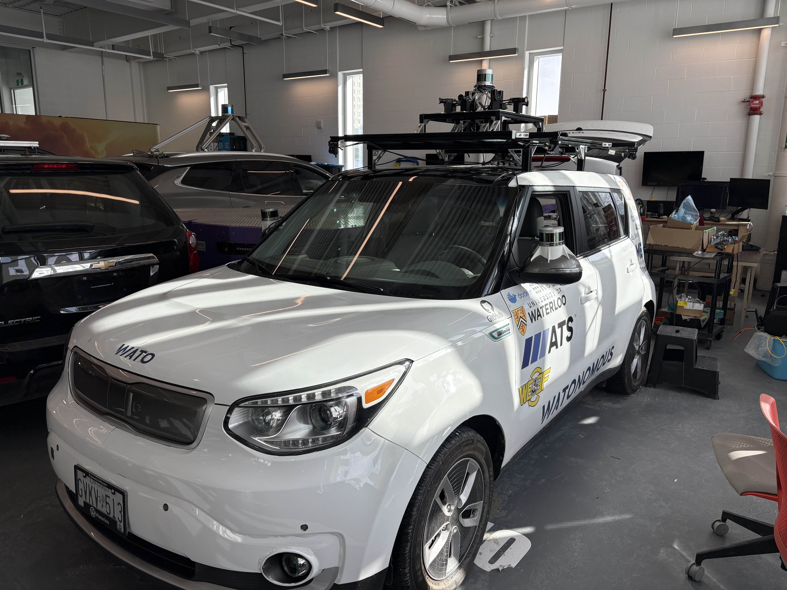
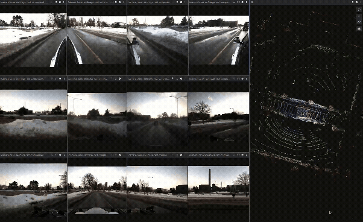
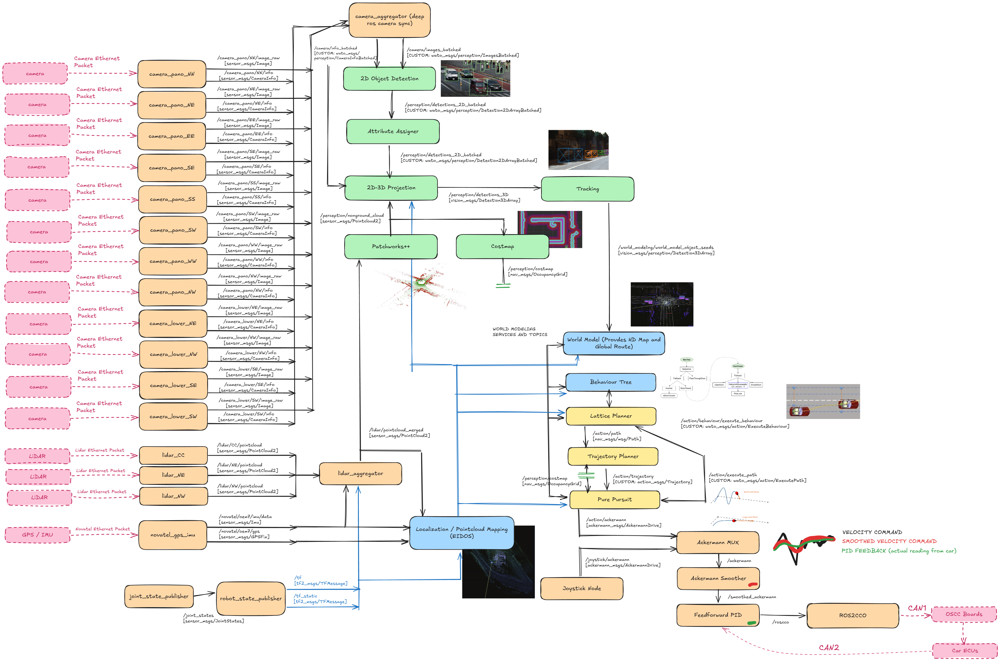

# WATonomous Monorepo (for EVE)

Dockerized monorepo for the WATonomous autonomous vehicle project (dubbed EVE).

  
  
  
  
  

## Prerequisite Installation
These steps are to setup the monorepo to work on your own PC. We utilize docker to enable ease of reproducibility and deployability.

> Why docker? It's so that you don't need to download any coding libraries on your bare metal pc, saving headache :3

1. Our monorepo infrastructure supports Linux Ubuntu >= 22.04, Windows (WSL/WSL2), and MacOS. Though, aspects of this repo might require specific hardware like NVidia GPUs.
2. Once inside Linux, [Download Docker Engine using the `apt` repository](https://docs.docker.com/engine/install/ubuntu/#install-using-the-repository). If you are using WSL, install docker outside of WSL, it will automatically setup docker within WSL for you.
3. You're all set! Information on running the monorepo with our infrastructure is given [here](https://wiki.watonomous.ca/autonomous_software_general/monorepo_infrastructure/)

## Large File Storage
Some nodes require larger files like model weights and maps. Furthermore, we might want to test our codebase on bag recordings which are even larger. These files are stored in our **Google Drive** (Only accessible by WATonomous members):
- [**Bag Recordings**](https://drive.google.com/drive/folders/127Kw3o7Org474rkK1wwMDRZKiYHaR0Db) (place inside a wato_monorepo/bags/ directory for full functionality) 
- [**Maps**](https://drive.google.com/drive/folders/19dYQiaLV9ZQ7KtriXxWlO38N4E2GCZSF) (place inside a wato_monorepo/maps/ directory for full functionality)
  - **REQUIRED** by **world_modeling** (map elements for localization on an existing map, .osm file for HD map) (not required when running simulation)
- [**Weights**](https://drive.google.com/drive/folders/10EXFocqX40L4JLPhppSyHl9GuhrG9wPj?usp=sharing) (place inside a wato_monorepo/weights/ directory for full funtionality)
  - **REQUIRED** by **perception** (model weights for inference)

## Available Modules

`Infrastructure` Starts the foxglove bridge and data streamer for rosbags.

`Interfacing` Launches packages directly connecting to hardware. This includes the sensors of the car and the car itself. [see docs](src/interfacing/INTERFACING_README.md)

`Perception` Launches packages for perception. [see docs](src/perception/PERCEPTION_README.md)

`World Modeling` Launches packages for world modeling. [see docs](src/world_modeling/WM_README.md)

`Action` Launches packages for action. [see docs](src/action/ACTION_README.md)

`Simulation` Launches packages CARLA simulator. [see docs](src/simulation/CARLA_README.md)

## System Architecture

## Contribute

Information on contributing to the monorepo is given in [DEVELOPING.md](./DEVELOPING.md)
