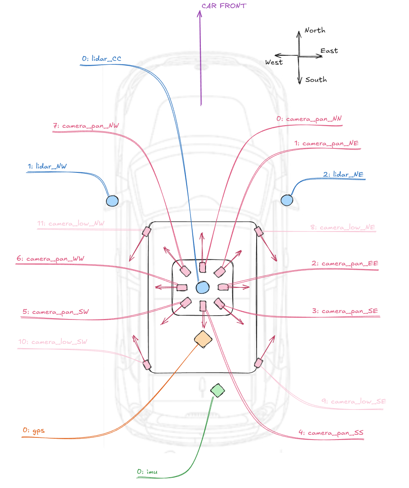

# Interfacing Packages

Directory of packages that have to do with interfacing. Information about each package can be found in their respective directory.

To see general network bringup information, see [the inferfacing bringup readme](./interfacing_bringup/README.md)

## Sensor Placement and Naming Convention
Eve's sensor placement follows cardinal directions as shown below. They are also mapped to specific indicies.



This naming convention is used for all sensor setup and transforms.

## Sub-System Diagram

## Network Configuration
Given that some of our sensors are connected via ethernet, some extra work needs to be done to ensure that all sensors are properly configured and connectable on startup.

Doing so requires knowledge in networking, which can get pretty convoluted.

At a high level, here's what needs to happen in order to make this work:
- We configure the SFP port to act as a local subnet with a DHCP server. (using common IP range for local network 10.x.x.x/16)
  - That way any sensor asking for an IP address on startup will get it from our local PC's DHCP server instead of the internet.
  - This means that when the car is NOT connected to the internet, sensors can still be configured properly.
  - Without this, sensors will be unable to acquire an IP address, or alternatively cycle between different IP addresses periodically. Both are not ideal.
- We ensure that our ethernet port on the motherboard has a direct pathway to the internet.
  - We still want to be able to connect the car to the internet so that we can SSH into it for development.
  - We want to do so without exposing our sensors to the internet without a

### Installing dnsmasq
To setup a computer to act as a DHCP server, we will be installing `dnsmasq` on the robot PC.

```bash
sudo apt update
sudo apt install dnsmasq -y
```

We will be doing static IP assignments by MAC address. Each device has a unique MAC address giving us a way to determine its identity.

Edit `/etc/dnsmasq.d/robot-net.conf`

```conf
interface=br0
bind-dynamic

# General DHCP pool (fallback)
dhcp-range=10.8.0.100,10.8.0.200,12h

# Static assignments by MAC
dhcp-host=00:21:66:04:A1:EC,10.8.0.8    # Novatel GPS/IMU (MAC address on the GPS receiver is wrong by 1 byte)

dhcp-host=00:B0:9D:1A:F0:0E,10.8.0.18   # Blackfly Cam 1 17453317
dhcp-host=00:B0:9D:0A:50:F8,10.8.0.19   # Blackfly Cam 2 17453304
dhcp-host=00:B0:9D:0A:51:05,10.8.0.20   # Blackfly Cam 3 18542606

# Hikrobot MV-CU013-80GC
# (Note, camera_aravis2 disables DHCP for these cameras on reboot)
# panorama cameras
dhcp-host=34:BD:20:79:38:D9,10.8.0.30    # 0: camera_pan_NN
dhcp-host=34:BD:20:79:39:11,10.8.0.31    # 1: camera_pan_NE
dhcp-host=34:BD:20:79:38:CB,10.8.0.32    # 2: camera_pan_EE
dhcp-host=34:BD:20:79:39:0F,10.8.0.33    # 3: camera_pan_SE
dhcp-host=34:BD:20:79:38:FD,10.8.0.34    # 4: camera_pan_SS
dhcp-host=34:BD:20:79:38:D4,10.8.0.35    # 5: camera_pan_SW
dhcp-host=34:BD:20:79:38:E5,10.8.0.36    # 6: camera_pan_WW
dhcp-host=34:BD:20:79:38:E4,10.8.0.37    # 7: camera_pan_NW

# side cameras
dhcp-host=34:BD:20:79:38:FB,10.8.0.38    # 8: camera_low_NE
dhcp-host=34:BD:20:79:38:CA,10.8.0.39    # 9: camera_low_SE
dhcp-host=34:BD:20:79:C4:2D,10.8.0.40    # 10: camera_low_SW
dhcp-host=34:BD:20:79:C4:3A,10.8.0.41    # 11: camera_low_NW

dhcp-host=60:76:88:34:30:94,10.8.0.88   # VLP32 Top Lidar
dhcp-host=60:76:88:10:31:60,10.8.0.89   # VLP16 Side Lidar
dhcp-host=60:76:88:10:52:17,10.8.0.90   # VLP16 Side Lidar
```

We do not setup a gateway. That is, we do not tell our sensors how to reach networks outside their subnet (ie. the internet)

Use the updated config with

```sh
sudo systemctl restart dnsmasq
```

And check leases with

```sh
cat /var/lib/misc/dnsmasq.leases
```

### Configuring Netplan
> If you are having trouble connecting the computer to the internet, then high chance is that this netplan configuration needs to change.

Edited `/etc/netplan/01-netcfg.yaml`

```yaml
network:
  version: 2
  ethernets:
    enp7s0: # motherboard ethernet interface for PC
      dhcp4: true
    enp8s0f0:
      dhcp4: no
      mtu: 9000
    enp8s0f1:  # second SFP port, also connected to switch
      dhcp4: no
      mtu: 9000
  bridges:
    br0:
      interfaces: [enp8s0f0, enp8s0f1]
      addresses:
        - 10.8.0.1/16
      mtu: 9000
```

Apply changes with

```sh
sudo netplan apply
```

### Clashes with Network Manager
If `ip a show enp8s0f1` shows an IP different from the one you configured with Netplan, then there is a chance that another tool is managing `enp8s0f1` and overriding Netplan. In our case, NetworkManager was overriding.

To see which profile controls `enp8s0f1`:

```bash
nmcli device status
nmcli connection show
```

If managed by profile "Wired connection 1", we modify NetworkManager's existing profile (or create a new one):

```bash
sudo nmcli connection modify "Wired connection 1" ipv4.method manual ipv4.addresses 10.8.0.1/16
sudo nmcli connection modify "Wired connection 1" 802-3-ethernet.mtu 9000
sudo nmcli connection down "Wired connection 1"
sudo nmcli connection up "Wired connection 1"
```

### IEEE 1588 Precision Time Protocol (PTP)

Not all sensors support PTP. For example, our main Hikrobot cameras are not supported.

## Custom messages

Custom messages may be used to help send messages between nodes. [see docs](../wato_msgs/MSGS_README.md)
