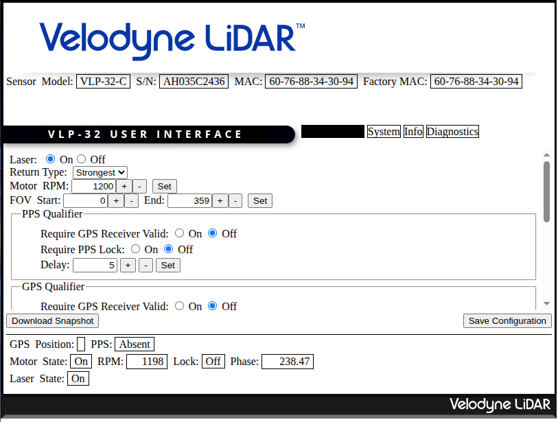
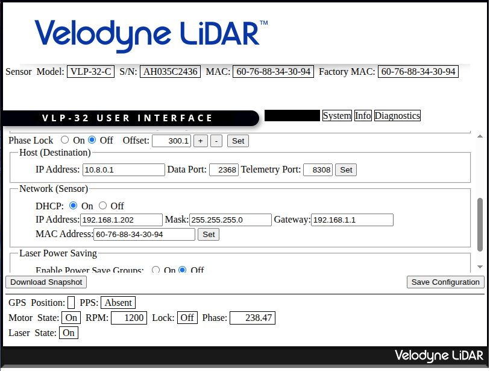

# LiDAR Bringup

## SDK Settings

Access the SDK of the Lidar through searching its IP address in a browser (the IP address was assigned via dnsmasq, if not, then it might have assigned itself a static IP). You can access the LiDAR's SDK through the machine it is connected to (that is, the onboard computer), or by forwarding the right ports via ssh to your local machine.

```sh
ssh -L 8080:$LIDAR_IP:80 -L 2368:$LIDAR_IP:2368 -L 8308:$LIDAR_IP:8308 watonomous@$EVE_IP
```

Replace `$LIDAR_IP` and `$EVE_IP` with their respective IP addresses (lidar is from dnsmasq, eve is from tailscale).

Connect to the lidar from your browser by searching up `localhost:8080`.

You should see the following page:


Important settings for networking:


- **DHCP must be on to let dnsmasq manage this lidar's IP Address**
- **The Host Destination must be set to the host 10.8.0.1 as to not flood other sensors** (the GPS specifically stops working otherwise)

## Launching Driver

A sample launchfile is given:

```sh
ros2 launch interfacing_bringup lidar_launch_vlp32.yaml
```

We link all sensor launchfiles into a singular launchfile inside our docker container via [interfacing_bringup](../../interfacing_bringup/)

## Additional Links

https://icave2.cse.buffalo.edu/resources/sensor-modeling/VLP32CManual.pdf
