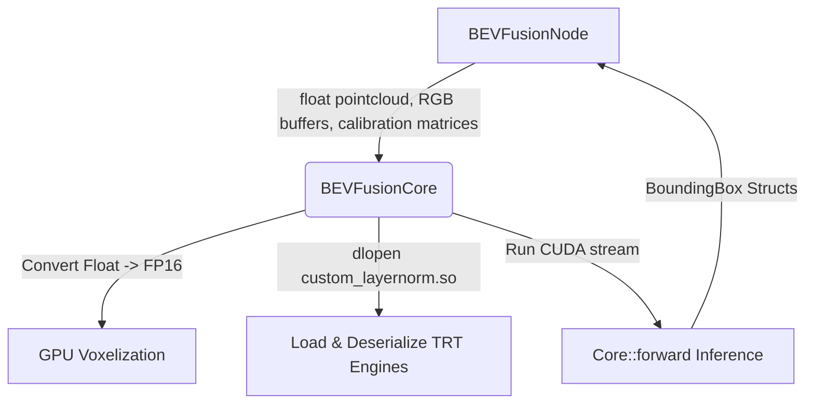

# The Big Picture
We want a system that takes in 6 raw camera image feeds + 1 LiDAR point cloud, runs them through our GPU-accelerated TensorRT BEVFusion model, and outputs 3D bounding boxes.

To keep this system clean, maintainable, and easy to debug, we split it into two layers:
1. **`BEVFusionCore`**: Pure C++ & CUDA wrapper around the underlying NVIDIA/WATO engine. Knows nothing about ROS.
2. **`BEVFusionNode`**: ROS 2 Lifecycle Node wrapper. Manages topics, parameters, synchronization, coordinate frames (TF2), and translates ROS messages to/from raw C++ structures.

---

## 1. `BEVFusionCore` (The C++/CUDA Engine Wrapper)
**Purpose:** Handles low-level GPU setup, data type conversion, and network inference.



* **`initialize()`**
  * **Purpose:** Loads the custom layer-normalization library via `dlopen`, configures model architecture parameters, creates a CUDA stream, and deserializes the five `.plan` / `.onnx` TensorRT engines into GPU memory.
  * **Why:** Deserializing the models takes a few seconds and allocates substantial GPU memory. By doing this once in a dedicated method, we can trigger it during the ROS `on_configure` state before any real data starts flowing.
  * **Key steps inside the function:**

        1. `dlopen("libcustom_layernorm.so", RTLD_NOW)` — **Why:** The detection head uses a custom Layer Normalization layer not natively supported by vanilla TensorRT. Without loading this shared object first, the TRT engine deserializer will fail to parse `head.bbox.plan`.
        2. Build configuration parameters (`NormalizationParameter`, `VoxelizationParameter`, `SCNParameter`, `GeometryParameter`, `TransBBoxParameter`) using the `Config`.
        3. *Note:* Hardcode `normalization.interpolation = bevfusion::camera::Interpolation::Bilinear;` since bilinear interpolation is universally standard for deep learning resize operations.
        4. Call `bevfusion::create_core(param)` and store it in `core_`.
        5. Create a CUDA stream: `cudaStreamCreate(&stream_)` — **Why:** CUDA operations execute asynchronously. Creating a dedicated stream ensures memory transfers and network execution for BEVFusion happen in order inside their own queue, without blocking the rest of the application's GPU operations.

* **`updateCalibration(...)`**
  * **Purpose:** Updates the GPU geometry-mapping kernels with the `6 x 4 x 4` camera extrinsics, intrinsics, and image augmentation/downscaling matrices.
  * **Why:** Since the camera positions on the vehicle are fixed, we only need to compute and upload these transformation matrices once at startup (or whenever camera calibrations update), rather than doing it on every frame.
* **`infer(...)`**
  * **Purpose:** Converts the input LiDAR point cloud from standard 32-bit float (`float`) to 16-bit half-precision (`nvtype::half`) as required by the GPU voxelization kernels, then runs the forward inference pass.
  * **Why:** ROS 2 provides standard float point clouds, but the high-performance CUDA implementation requires FP16 for speed. Keeping this conversion inside `infer` keeps it hidden from the ROS node.

---

## 2. `BEVFusionNode` (The ROS 2 Lifecycle Wrapper)
**Purpose:** Bridges the C++ inference engine with the ROS 2 ecosystem.

### Main Lifecyle Hooks
* **`declareParameters()`**
  * **Purpose:** Declares all ROS 2 parameters (like model paths, camera topic names, and confidence thresholds) and instantiates the `BEVFusionCore` with default parameters.
  * **Why:** Allows configuring the node dynamically via launch files or YAML configs without modifying source code.
* **`on_configure()`**
  * **Purpose:** Retrieves the declared parameters, builds the `BEVFusionInputParams` config struct, instantiates the `BEVFusionCore`, calls `core_->initialize()`, and prepares ROS publishers/subscribers.
  * **Why:** This is the standard ROS 2 lifecycle phase for preparing dependencies and loading heavy resources (like the model engines) before starting execution.
* **`on_activate()`**
  * **Purpose:** Listens to camera info/TFs to construct calibration matrices, calls `core_->updateCalibration()`, creates subscribers for sensor data, and activates publishers.
  * **Why:** This state guarantees the node is ready to process data immediately. We wait to subscribe to sensor topics until here to avoid building up queue lag before the model is fully initialized.

#### Core Processing Functions
* **`cameraInfoCallback(...)`**
  * **Purpose:** Subscribes to the static camera calibration parameters (intrinsics) and caches them.
  * **Why:** We need camera intrinsics to project 3D points to 2D image coordinates. Listening to a camera info topic is cleaner than hardcoding them in config files.
* **`computeCalibrationMatrices()`**
  * **Purpose:** Queries TF2 for the camera-to-lidar transforms (extrinsics), extracts the cached intrinsics, computes the projection matrices, and formats them into the `6 x 4 x 4` format expected by `BEVFusionCore`.
  * **Why:** Resolving coordinate frame transforms (e.g., from `camera_front` to `base_link`) must be done through ROS's TF2 system.
* **`syncedCallback(images_msg, lidar_msg)`**
  * **Purpose:** The main pipeline driver. Whenever a synchronized frame of 6 images and a LiDAR scan arrives:
        1. Decodes/converts BGR image messages into raw RGB pointer arrays (`unsigned char*`).
        2. Parses the `PointCloud2` message into a flat `x, y, z, intensity, ring` format.
        3. Calls `core_->infer(...)`.
        4. Converts the output bounding boxes into ROS `Detection3DArray` and `MarkerArray` messages.
        5. Publishes the results.
  * **Why:** Fusing data requires temporal alignment (messages must represent the same moment in time). We process only when we have a matching set of camera and LiDAR frames.

# Other Helpful Notes

## How do we pass in the video feed?

**Frame by frame, as raw image pointers.** The CUDA-BEVFusion `Core::forward()` API ([bevfusion.hpp](https://github.com/WATonomous/wato-cuda-bevfusion/blob/master/CUDA-BEVFusion/src/bevfusion/bevfusion.hpp)) expects:

```cpp
std::vector<BoundingBox> forward(
    const unsigned char** camera_images,  // array of 6 host pointers to raw RGB images
    const nvtype::half* lidar_points,     // host pointer to Nx5 half-float points
    int num_points,
    void* stream
);
```

## Which topics to publish detections to

**Two topics, matching DEVELOPING.md:**

| Topic | Type | Purpose |
|---|---|---|
| `/perception/detections_3d_bev` | `vision_msgs/Detection3DArray` | 3D bounding boxes → consumed by [tracking node](file:///home/ashish/Documents/wato_monorepo/src/perception/tracking/tracking/src/tracking.cpp#L57) |
| `/perception/bev_detection_markers` | `visualization_msgs/MarkerArray` | Visualization → Foxglove |

**Why these specific topics:**
* The tracking node subscribes to `vision_msgs/Detection3DArray`, and in the `perception.launch.yaml` it's remapped from `input_detections` → `/perception/detections_3D`. We could publish directly to `/perception/detections_3D` (same topic spatial_association publishes to), or use a separate topic `/perception/detections_3d_bev` and remap at launch time. We should have a seperate topic for this so that we can run both pipelines (2D→spatial_association→3D and BEVFusion→3D) in parallel and choose which one feeds tracking via launch config.
* For Foxglove: `MarkerArray` is the standard. Foxglove's 3D panel natively renders `visualization_msgs/MarkerArray` as 3D cubes/wireframes. We create `Marker::CUBE` markers with the bounding box pose and dimensions. **This is the only thing we need for Foxglove visualization** — no custom panels required.

> TIP: Foxglove also supports `vision_msgs/Detection3DArray` directly in its 3D panel, but `MarkerArray` gives us more control over color, opacity, label text, and lifetime. Publish both.

---

## Converting `BoundingBox` → `Detection3DArray`

Each [BoundingBox](file:///home/ashish/Documents/Lidar_AI_Solution/CUDA-BEVFusion/src/bevfusion/head-transbbox.hpp#L60-L67) has:

```cpp
struct BoundingBox {
  Position position;  // x, y, z (in lidar frame)
  Size size;          // w, l, h
  Velocity velocity;  // vx, vy
  float z_rotation;   // yaw (radians)
  float score;        // confidence
  int id;             // class id (nuscenes: 0=car, 1=truck, ...)
};
```

Map to `vision_msgs::Detection3D`:
* `detection.header.frame_id = "base_link"` (or the lidar frame)
* `detection.bbox.center.position.x/y/z = position.x/y/z`
* `detection.bbox.center.orientation = quaternion_from_yaw(z_rotation)` — use `tf2::Quaternion` with roll=0, pitch=0, yaw=z_rotation
* `detection.bbox.size.x = size.l`, `.y = size.w`, `.z = size.h` (check axis convention — nuScenes uses l=forward, w=lateral, h=vertical)
* `detection.results[0].hypothesis.class_id = std::to_string(id)`
* `detection.results[0].hypothesis.score = score`

### Converting `BoundingBox` → `MarkerArray` (for Foxglove)

For each bbox, create a `visualization_msgs::Marker`:
* `marker.type = Marker::CUBE`
* `marker.pose = same as Detection3D center`
* `marker.scale.x/y/z = size dimensions`
* Color by class (e.g., cars=green, pedestrians=yellow, trucks=blue)
* `marker.lifetime = 0.1s` (so old markers disappear)
* `marker.ns = "bevfusion_detections"`
* `marker.id = unique per bbox per frame`
* `marker.header.frame_id = "base_link"`

> TIP: Add `marker.text = class_name + " " + score` for Foxglove to show labels on hover.

---

## Calibration Matrix Computation

This is the hardest part unique to the codebase. CUDA-BEVFusion's `Core::update()` expects four flat matrices, each `6 × 4 × 4` (num_cameras × 4 × 4):

| Matrix | What it is | Where we get it |
|---|---|---|
| `camera2lidar` | 4×4 transform from each camera frame to lidar frame | TF tree: `tf_buffer_->lookupTransform("base_link", camera_frame_id)` → invert to get camera→lidar. Or directly `lookupTransform(lidar_frame, camera_frame)`. |
| `camera_intrinsics` | 3×3 camera K matrix, padded to 4×4 | From `MultiCameraInfo` → each `CameraInfo.k` (3×3 row-major). Pad to 4×4 with identity bottom-right. |
| `lidar2image` | 4×4 projection from lidar to each camera's image plane | `lidar2image = camera_intrinsics @ extrinsic_lidar2camera`. Compute from the above two. |
| `img_aug_matrix` | 4×4 augmentation matrix (resize + crop applied to images) | Depends on the image preprocessing. For the standard BEVFusion resize (resize_lim=0.48 on a 900→256 image), this is a scale+translate matrix. If we feed full-resolution images (1600×900), compute it from the resize parameters. |

**For `img_aug_matrix`:** The nuScenes BEVFusion preprocessing resizes images by `resize_lim` then crops. The augmentation matrix captures that transform:

```
scale = resize_lim * (output_height / image_height)
       = 0.48 * (256 / 900) ≈ 0.2844...
       Actually: resize_lim is applied to height, so:
       resize_ratio = output_height / (image_height * resize_lim) ?
```

Look at how [main.cpp](https://github.com/WATonomous/wato-cuda-bevfusion/blob/c07c91afc31d6cbeed91448e419b81717658e41a/CUDA-BEVFusion/src/main.cpp#L249) loads `img_aug_matrix.tensor` from the example data. The example data has it pre-computed. **For the car, we need to compute this from the camera resolution and the model's expected input size.** The normalization stage in CUDA-BEVFusion handles the actual resize — the `img_aug_matrix` tells the geometry computation how image coordinates map back to 3D.

> IMPORTANT: Getting the calibration matrices right is critical. Wrong matrices = detections in wrong positions. We should probably first test with the CUDA-BEVFusion example data to verify the `BEVFusionCore` wrapper works, then tackle the ROS calibration matrix computation.

---

## CUDA info
1. **CUDA Streams**: `Core::forward()` takes a `cudaStream_t`. To create and destroy it, the node calls `cudaStreamCreate(&stream_)` and `cudaStreamDestroy(stream_)`. These require `<cuda_runtime.h>` and linking against the CUDA runtime (`cudart`).
2. **FP16 Types**: The library expects LiDAR points as `nvtype::half*`. This is a wrapper around CUDA's `__half` type from `<cuda_fp16.h>`. the compiler needs the CUDA headers to use this type and the intrinsics for converting standard 32-bit `float` to 16-bit `half`.

## Config and Launch

### params.yaml
Fill in all defaults:

```yaml
---
bevfusion_node:
  ros__parameters:
    model_dir: "/opt/watonomous/models/bevfusion/resnet50"
    camera_names:
      - "camera_pano_nn"
      - "camera_pano_ne"
      - "camera_pano_nw"
      - "camera_pano_ss"
      - "camera_pano_se"
      - "camera_pano_sw"
    confidence_threshold: 0.3
    sync_max_time_diff_ms: 200.0
    sync_queue_size: 10
    qos_subscriber_reliability: "best_effort"
    qos_publisher_reliability: "reliable"
```

### perception.launch.yaml

The BEVFusion section is already there (L119-L137). We'll need to add remaps once the node declares topic parameters:

```yaml
remap:
  - from: output_detections_3d
    to: /perception/detections_3d_bev
  - from: output_markers
    to: /perception/bev_detection_markers
```

---

## Class ID Mapping (nuScenes)

The BoundingBox `id` field maps to nuScenes object classes:

| ID | Class |
|---|---|
| 0 | car |
| 1 | truck |
| 2 | construction_vehicle |
| 3 | bus |
| 4 | trailer |
| 5 | barrier |
| 6 | motorcycle |
| 7 | bicycle |
| 8 | pedestrian |
| 9 | traffic_cone |

Use these for setting `class_id` in Detection3D and marker colors.

---

## Key Gotchas

1. **Image format**: CUDA-BEVFusion expects **RGB** `unsigned char*`. OpenCV decodes to **BGR**. We need `cv::cvtColor(img, img, cv::COLOR_BGR2RGB)`.

2. **Image resolution**: The normalization expects `1600×900` images (nuScenes default). the cameras are `1280×1024`. We'll need to either:
   * Update `NormalizationParameter.image_width/image_height` to match the cameras
   * Or resize to 1600×900 before passing (wasteful)
   * The model was trained on 1600×900 → 704×256, so we may need to retrain or adjust the aug matrix

3. **Lidar point format and iterators**: Use `#include <sensor_msgs/point_cloud2_iterator.hpp>` and `sensor_msgs::PointCloud2ConstIterator<float>` to safely extract points without manual byte math. `PointCloud2` has fields like `x, y, z, intensity`. We **must** extract exactly 5 features per point as `nvtype::half` (x, y, z, intensity, ring). If the merged cloud lacks a `ring` channel, we must allocate 5 floats per point and pad the 5th value with `0.0f`. Passing 4 features breaks CUDA memory alignment and causes crashes.

4. **Thread safety**: The CUDA-BEVFusion `Core` is **not thread-safe**. Don't call `forward()` from multiple callbacks simultaneously. Use a mutex or ensure single-threaded execution.

5. **`dlopen` for custom_layernorm**: Must be called before `create_core()`. Include `<dlfcn.h>` in `bevfusion_core.cpp`. If it fails silently, TRT will fail to deserialize the head.bbox engine. Always check the return value.

6. **Frame IDs and Base Link**: BEVFusion outputs bounding boxes in the **same coordinate frame as the input LiDAR points**. If the input `PointCloud2` is in `lidar_merged`, the output boxes are relative to `lidar_merged`. However, downstream tracking expects detections in `base_link`. We have two choices:
   1. Transform the output 3D bounding boxes from `lidar_merged` to `base_link` *after* inference using `tf2`.
   2. **(Recommended)** Transform the LiDAR points into `base_link` *before* passing them to BEVFusion, and ensure the `camera2lidar` matrix is actually `camera2base_link`. BEVFusion treats the "lidar" frame as just a central origin, so if everything is fed in `base_link`, it outputs in `base_link`.

7. **First inference is slow**: TRT engine deserialization + warmup takes 5-15 seconds. Consider calling `core_->infer()` once with dummy data during `on_configure()` or `on_activate()` so the first real frame isn't delayed.

---

## Testing

```bash
colcon build --packages-up-to bevfusion --cmake-args -DBUILD_TESTING=ON
colcon test --packages-select bevfusion
colcon test-result --verbose
```

> **Note:** Build warnings from `bevfusion_core.cpp` (`no return statement` in stub functions) are expected until `initialize()` and `infer()` are implemented.
