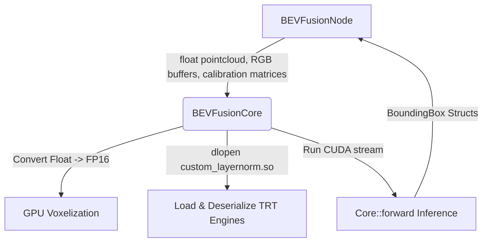

# The Big Picture
We want a system that takes in 6 raw camera image feeds + 1 LiDAR point cloud, runs them through our GPU-accelerated TensorRT BEVFusion model, and outputs 3D bounding boxes.

To keep this system clean, maintainable, and easy to debug, we split it into two layers:
1. **`BEVFusionCore`**: Pure C++ & CUDA wrapper around the underlying NVIDIA/WATO engine. Knows nothing about ROS.
2. **`BEVFusionNode`**: ROS 2 Lifecycle Node wrapper. Manages topics, parameters, synchronization, coordinate frames (TF2), and translates ROS messages to/from raw C++ structures.

---

## 1. `BEVFusionCore` (The C++/CUDA Engine Wrapper)
**Purpose:** Handles low-level GPU setup, data type conversion, and network inference.



* **`initialize()`**
  * **Purpose:** Loads the custom layer-normalization library via `dlopen`, auto-builds any missing TensorRT `.plan` engines from ONNX, configures model architecture parameters, deserializes the five `.plan` / `.onnx` files into GPU memory, and creates a CUDA stream.
  * **Why:** Deserializing the models takes a few seconds and allocates substantial GPU memory. By doing this once in a dedicated method, we can trigger it during the ROS `on_configure` state before any real data starts flowing.
  * **Key steps inside the function (as implemented in `bevfusion_core.cpp`):**

        1. `dlopen("libcustom_layernorm.so", RTLD_NOW)` — **Why:** The detection head uses a custom Layer Normalization layer not natively supported by vanilla TensorRT. Without loading this shared object first, the TRT engine deserializer will fail to parse `head.bbox.plan`.
        2. `checkModelFilesExist()` — verifies the four `.plan` engines (`camera.backbone`, `camera.vtransform`, `fuser`, `head.bbox`) and the `lidar.backbone.xyz.onnx` file are present in `build_dir` / `model_dir`. If any `.plan` is missing, `buildTRTEngines()` compiles it from the corresponding `.onnx` via `compileTrtModel()` (uses `nvinfer1::IBuilder` + `nvonnxparser::IParser`, writes the serialized engine to disk). This lets a fresh checkout build engines on first run instead of requiring them to be pre-baked into the model directory.
        3. Build configuration parameters (`NormalizationParameter`, `VoxelizationParameter`, `SCNParameter`, `GeometryParameter`, `TransBBoxParameter`) from the `BEVFusionInputConfig` struct (populated by the node from ROS parameters).
        4. *Note:* `interpolation` defaults to bilinear (`config_.interpolation == "bilinear"`) and is not currently exposed as a ROS parameter — bilinear is the only mode used in practice, though the struct does support switching to nearest-neighbor.
        5. Call `bevfusion::create_core(param)` and store it in `pipeline_`.
        6. Create a CUDA stream: `cudaStreamCreate(&stream_)` — **Why:** CUDA operations execute asynchronously. Creating a dedicated stream ensures memory transfers and network execution for BEVFusion happen in order inside their own queue, without blocking the rest of the application's GPU operations.

* **`updateCalibration(...)`**
  * **Purpose:** Updates the GPU geometry-mapping kernels with the `6 x 4 x 4` camera extrinsics, intrinsics, and image augmentation/downscaling matrices.
  * **Why:** Since the camera positions on the vehicle are fixed, we only need to compute and upload these transformation matrices once at startup (or whenever camera calibrations update), rather than doing it on every frame.
* **`infer(...)`**
  * **Purpose:** Converts the input LiDAR point cloud from standard 32-bit float (`float`) to 16-bit half-precision (`nvtype::half`) as required by the GPU voxelization kernels, then runs the forward inference pass.
  * **Why:** ROS 2 provides standard float point clouds, but the high-performance CUDA implementation requires FP16 for speed. Keeping this conversion inside `infer` keeps it hidden from the ROS node.

---

## 2. `BEVFusionNode` (The ROS 2 Lifecycle Wrapper)
**Purpose:** Bridges the C++ inference engine with the ROS 2 ecosystem.

### Main Lifecyle Hooks
* **`declareParameters()`**
  * **Purpose:** Declares all ROS 2 parameters (like model paths, camera topic names, and confidence thresholds) and instantiates the `BEVFusionCore` with default parameters.
  * **Why:** Allows configuring the node dynamically via launch files or YAML configs without modifying source code.
* **`on_configure()`**
  * **Purpose:** Retrieves the declared parameters, builds the `BEVFusionInputParams` config struct, instantiates the `BEVFusionCore`, calls `core_->initialize()`, and prepares ROS publishers/subscribers.
  * **Why:** This is the standard ROS 2 lifecycle phase for preparing dependencies and loading heavy resources (like the model engines) before starting execution.
* **`on_activate()`**
  * **Purpose:** Listens to camera info/TFs to construct calibration matrices, calls `core_->updateCalibration()`, creates subscribers for sensor data, and activates publishers.
  * **Why:** This state guarantees the node is ready to process data immediately. We wait to subscribe to sensor topics until here to avoid building up queue lag before the model is fully initialized.

#### Core Processing Functions
* **`multiCameraInfoCallback(...)`**
  * **Purpose:** Subscribes to `MultiCameraInfo` (static camera intrinsics for all cameras), filters/reorders it to match `camera_names`, caches it, and triggers `computeCalibrationMatrices()`. Skips work once `calibration_initialized_` is already true, since intrinsics/extrinsics don't change at runtime.
  * **Why:** We need camera intrinsics to project 3D points to 2D image coordinates. Listening to a camera info topic is cleaner than hardcoding them in config files.
* **`computeCalibrationMatrices()`**
  * **Purpose:** Queries TF2 for the camera-to-lidar transforms (extrinsics), extracts the cached intrinsics, computes the projection matrices, and formats them into the `6 x 4 x 4` format expected by `BEVFusionCore`.
  * **Why:** Resolving coordinate frame transforms (e.g., from `camera_front` to `base_link`) must be done through ROS's TF2 system.
* **`syncedCallback(multi_image_msg, lidar_msg)`**
  * **Purpose:** The main pipeline driver. Whenever a synchronized `MultiImageCompressed` + `PointCloud2` frame arrives:
        1. Filters/reorders `multi_image_msg->images` to match `camera_names_`, JPEG-decodes each (`cv::imdecode`) and converts BGR→RGB into raw pointer arrays (`unsigned char*`), resizing if a decoded image doesn't match the configured `image_width`/`image_height`.
        2. Parses the `PointCloud2` message into a flat `x, y, z, intensity, ring` format (`processLidar()`). The `ring` field is optional — if the `has_ring` parameter is `false`, ring values are omitted (padded with a zero feature implicitly by the model).
        3. Validates camera count, image format, and LiDAR point count/format against `config_`, then calls `core_->infer(...)`.
        4. Converts the output bounding boxes into ROS `Detection3DArray` (`createDetections3D()`) and `MarkerArray` (`createMarkers()`) messages. Each bounding box is transformed from `lidar_frame_id` to `target_frame` via a single `tf_buffer_->lookupTransform` + `tf2::doTransform` call.
        5. Publishes the results and updates statistics/diagnostics.
  * **Why:** Fusing data requires temporal alignment (messages must represent the same moment in time). We process only when we have a matching set of camera and LiDAR frames, and validate defensively since malformed input would otherwise crash the CUDA pipeline.

# Other Helpful Notes

## How do we pass in the video feed?

**Frame by frame, as raw image pointers, after decompressing on the CPU.** Images arrive JPEG-compressed inside `deep_msgs/MultiImageCompressed`; `syncedCallback()` decodes each with `cv::imdecode`, converts BGR→RGB, and passes the resulting `cv::Mat::data` pointers straight through to `BEVFusionCore::infer()`, which forwards them unchanged to the CUDA-BEVFusion `Core::forward()` API ([bevfusion.hpp](https://github.com/WATonomous/wato-cuda-bevfusion/blob/master/CUDA-BEVFusion/src/bevfusion/bevfusion.hpp)):

```cpp
std::vector<BoundingBox> forward(
    const unsigned char** camera_images,  // array of N host pointers to raw RGB images
    const nvtype::half* lidar_points,     // host pointer to Nx5 half-float points
    int num_points,
    void* stream
);
```

## Which topics to publish detections to

**Two topics — implemented, node declares `output_detections`/`output_markers`, remapped in `perception.launch.yaml`:**

| Topic | Type | Purpose |
|---|---|---|
| `/perception/detections_3d_bev` | `vision_msgs/Detection3DArray` | 3D bounding boxes; kept on a separate topic from `spatial_association`'s output so both 2D→3D and BEVFusion→3D pipelines can run in parallel, with launch config choosing which one feeds `tracking` |
| `/perception/bev_detection_markers` | `visualization_msgs/MarkerArray` | Visualization → Foxglove |

**Why these specific topics:**
* Using a separate topic (rather than the topic `spatial_association` publishes `Detection3DArray` to) means both the 2D→spatial_association→3D and BEVFusion→3D pipelines can run in parallel, and which one feeds `tracking` is a launch-time remap decision rather than a code change.
* For Foxglove: `MarkerArray` is the standard. Foxglove's 3D panel natively renders `visualization_msgs/MarkerArray` as 3D cubes/wireframes. We create `Marker::CUBE` markers with the bounding box pose and dimensions. **This is the only thing we need for Foxglove visualization** — no custom panels required.

> TIP: Foxglove also supports `vision_msgs/Detection3DArray` directly in its 3D panel, but `MarkerArray` gives us more control over color, opacity, label text, and lifetime. Publish both.

---

## Converting `BoundingBox` → `Detection3DArray`

Each [BoundingBox](file:///home/ashish/Documents/Lidar_AI_Solution/CUDA-BEVFusion/src/bevfusion/head-transbbox.hpp#L60-L67) has:

```cpp
struct BoundingBox {
  Position position;  // x, y, z (in lidar frame)
  Size size;          // w, l, h
  Velocity velocity;  // vx, vy
  float z_rotation;   // yaw (radians)
  float score;        // confidence
  int id;             // class id (nuscenes: 0=car, 1=truck, ...)
};
```

`createDetections3D()` (`bevfusion_node.cpp`) maps to `vision_msgs::Detection3D` as implemented:
* BEVFusion outputs boxes in `lidar_frame_id`. A single `tf_buffer_->lookupTransform(target_frame_, lidar_frame_id_, stamp, timeout)` is done per callback and each pose is transformed to `target_frame` via `tf2::doTransform`.
* `detection.header.frame_id = target_frame_` (default `base_link`)
* `detection.bbox.center` — position from bbox, orientation from `tf2::Quaternion::setRPY(0, 0, -z_rotation)` (negated to convert BEV-map convention to ROS convention), both transformed to `target_frame`
* `detection.bbox.size.x = size.w`, `.y = size.l`, `.z = size.h`
* `detection.results[0].hypothesis.class_id = std::to_string(id)`
* `detection.results[0].hypothesis.score = score`

### Converting `BoundingBox` → `MarkerArray` (for Foxglove)

`createMarkers()` (`bevfusion_node.cpp`) creates one `visualization_msgs::Marker` per bbox, as implemented:
* `marker.type = Marker::CUBE`
* `marker.pose` = same position/orientation as the `Detection3D` center (already in `target_frame`)
* `marker.scale.x/y/z = size.w/l/h`
* Color by class via a `switch (class_id)` — all 10 nuScenes classes are mapped to distinct colors (see the class ID table below)
* `marker.color.a = 0.8`, `marker.lifetime = 0.5s` (so stale markers disappear)
* `marker.ns = "bevfusion_detections"`, `marker.id` = index into the current frame's marker array
* `marker.header.frame_id = target_frame_`
* A `DELETEALL` marker is prepended to clear stale markers from the previous frame

Not yet implemented: `marker.text` labels (class name + score) for Foxglove hover tooltips — this is a possible follow-up.

---

## Calibration Matrix Computation

This is the hardest part unique to the codebase. CUDA-BEVFusion's `Core::update()` expects four flat matrices, each `6 × 4 × 4` (num_cameras × 4 × 4):

| Matrix | What it is | Where we get it |
|---|---|---|
| `camera2lidar` | 4×4 transform from each camera frame to lidar frame | As implemented: `tf_buffer_->lookupTransform(lidar_frame_id_, camera_info.header.frame_id, tf2::TimePointZero)` directly (no inversion needed since we look up straight from lidar frame to camera frame). |
| `camera_intrinsics` | 3×3 camera K matrix, padded to 4×4 | From `MultiCameraInfo` → each `CameraInfo.k` (3×3 row-major). Pad to 4×4 with identity bottom-right. |
| `lidar2image` | 4×4 projection from lidar to each camera's image plane | `lidar2image = camera_intrinsics @ extrinsic_lidar2camera`. Compute from the above two. |
| `img_aug_matrix` | 4×4 augmentation matrix (resize + crop applied to images) | Depends on the image preprocessing. For the standard BEVFusion resize (resize_lim=0.48 on a 900→256 image), this is a scale+translate matrix. If we feed full-resolution images (1600×900), compute it from the resize parameters. |

**`img_aug_matrix` — as implemented in `computeCalibrationMatrices()`:**

```cpp
int resized_w = image_width * resize_lim;
int resized_h = image_height * resize_lim;
int crop_x = (resized_w - norm_output_width) / 2;   // centered horizontal crop
int crop_y = resized_h - norm_output_height;        // bottom-aligned vertical crop
```

The resulting 4x4 matrix scales by `resize_lim` on the X/Y diagonal and translates by `-crop_x` / `-crop_y`. This is a simplified augmentation matrix (scale + translate only, no rotation/flip) — it's covered by `test_bevfusion_node.cpp`, which checks the nuScenes-default case (`1600x900`, `resize_lim=0.48` → `crop_x=32`, `crop_y=176`) against the upstream CUDA-BEVFusion example values.

> IMPORTANT: Getting the calibration matrices right is critical. Wrong matrices = detections in wrong positions. If you change `image_width`, `image_height`, `resize_lim`, or `norm_output_width/height`, re-verify against `test_bevfusion_node.cpp`'s `img_aug_matrix` test cases and, ideally, real detections on a known scene.

---

## CUDA info
1. **CUDA Streams**: `Core::forward()` takes a `cudaStream_t`. To create and destroy it, the node calls `cudaStreamCreateWithFlags(&stream_, cudaStreamNonBlocking)` and `cudaStreamDestroy(stream_)`. The `NonBlocking` flag prevents BEVFusion's GPU ops from implicitly synchronizing with the null (default) CUDA stream used by the rest of the application. These require `<cuda_runtime.h>` and linking against the CUDA runtime (`cudart`).
2. **FP16 Types**: The library expects LiDAR points as `nvtype::half*`. This is a wrapper around CUDA's `__half` type from `<cuda_fp16.h>`. the compiler needs the CUDA headers to use this type and the intrinsics for converting standard 32-bit `float` to 16-bit `half`.

## Config and Launch

### params.yaml
This is done — see `bevfusion/config/params.yaml` for the full set of defaults (topics, model/build dirs, precision, camera resolution/resize, voxelization, BEV grid bounds, sync, and QoS). The vehicle-specific overrides live in `perception_bringup/config/perception_bringup.yaml` under `/**/bevfusion_node`; see the top-level [DEVELOPING.md](../DEVELOPING.md#parameters) parameter table for the full list.

### perception.launch.yaml

This is done. `bevfusion_node` is loaded as a composable node into `perception_container` in `perception_bringup/launch/perception.launch.yaml`, with remaps matching the node's declared topic names (`camera_info`, `output_detections`, `output_markers`):

```yaml
remap:
  - from: camera_info
    to: /multi_camera_sync/multi_camera_info
  - from: output_detections
    to: /perception/detections_3d_bev
  - from: output_markers
    to: /perception/bev_detection_markers
```

`multi_image` and `lidar` remaps are commented out in the launch file since, as noted above, `message_filters` subscribers don't reliably honor launch-time remaps — those two topics are set via `input_multi_image_topic` / `input_lidar_topic` in `params.yaml` / `perception_bringup.yaml` instead.

---

## Class ID Mapping (nuScenes)

The BoundingBox `id` field maps to nuScenes object classes:

| ID | Class |
|---|---|
| 0 | car |
| 1 | truck |
| 2 | construction_vehicle |
| 3 | bus |
| 4 | trailer |
| 5 | barrier |
| 6 | motorcycle |
| 7 | bicycle |
| 8 | pedestrian |
| 9 | traffic_cone |

Use these for setting `class_id` in Detection3D and marker colors.

The `createMarkers()` color mapping matches the nuScenes class table:

| ID | Class | Marker color |
|---|---|---|
| 0 | car | Green |
| 1 | truck | Blue |
| 2 | construction_vehicle | Orange |
| 3 | bus | Purple |
| 4 | trailer | Cyan |
| 5 | barrier | Yellow |
| 6 | motorcycle | Magenta |
| 7 | bicycle | Sky blue |
| 8 | pedestrian | Red |
| 9 | traffic_cone | Amber |
| other | — | White |

---

## Key Gotchas

1. **Image format**: CUDA-BEVFusion expects **RGB** `unsigned char*`. OpenCV decodes to **BGR**. We need `cv::cvtColor(img, img, cv::COLOR_BGR2RGB)`.

2. **Image resolution — resolved**: The model was trained on nuScenes' `1600×900 → 704×256` (resize_lim `0.48`). Eve's cameras are `1280×1024`, so `image_width`/`image_height`/`resize_lim` in `params.yaml` are set to `1280`/`1024`/`0.55` to reproduce roughly the same crop geometry into the same `704×256` network input — see `NormalizationParameter` construction in `BEVFusionCore::initialize()` and the `img_aug_matrix` math above. If you retrain on Eve-resolution data, revisit both `NormalizationParameter` and the aug matrix together.

3. **LiDAR point format and iterators**: `processLidar()` uses `PointCloud2ConstIterator<float>`/`PointCloud2ConstIterator<uint16_t>` to extract `x, y, z, intensity` (and optionally `ring`) without manual byte math. The `ring` field is **optional** — set the `has_ring` parameter to `true` if the configured LiDAR topic publishes a `ring` field (e.g. `lidar_cc`), or `false` to skip it (e.g. for merged clouds that may lack `ring`). When `has_ring` is `false`, only 4 features per point are emitted and you must ensure `num_features` in the model config matches.

4. **Thread safety**: The CUDA-BEVFusion `Core` is **not thread-safe**. Don't call `forward()` from multiple callbacks simultaneously. Use a mutex or ensure single-threaded execution.

5. **`dlopen` for custom_layernorm**: Must be called before `create_core()`. Include `<dlfcn.h>` in `bevfusion_core.cpp`. If it fails silently, TRT will fail to deserialize the head.bbox engine. Always check the return value.

6. **Frame IDs — resolved**: BEVFusion outputs bounding boxes in `lidar_frame_id`. `createDetections3D()` now performs a `tf_buffer_->lookupTransform(target_frame_, lidar_frame_id_, stamp)` per callback and applies `tf2::doTransform` to each bounding box pose before stamping the output with `target_frame_` (default `base_link`). Output detections are correctly expressed in `target_frame`.

7. **First inference is slow**: TRT engine deserialization + warmup takes 5-15 seconds. Consider calling `core_->infer()` once with dummy data during `on_configure()` or `on_activate()` so the first real frame isn't delayed.

---

## Testing

```bash
colcon build --packages-up-to bevfusion --cmake-args -DBUILD_TESTING=ON
colcon test --packages-select bevfusion
colcon test-result --verbose
```
