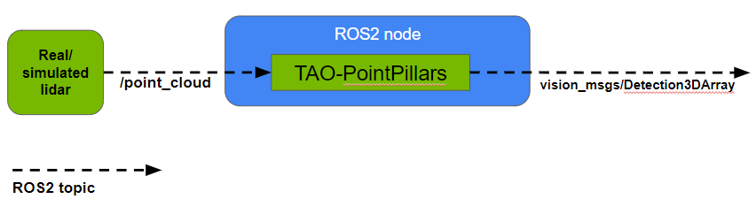
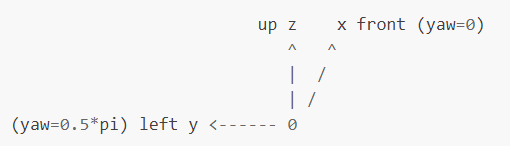

# ROS2 node for TAO-PointPillars

This is a ROS2 node for 3D object detection in point clouds using [TAO-PointPillars](https://catalog.ngc.nvidia.com/orgs/nvidia/teams/tao/models/pointpillarnet) for inference with TensorRT.

<p align="middle">

</p>

Node details:
- Input: Takes point cloud data in [PointCloud2](http://docs.ros.org/en/lunar/api/sensor_msgs/html/msg/PointCloud2.html) format on the topic `/point_cloud`. Each point in the data must contain 4 features - (x, y, z) position coordinates and intensity. ROS2 bags for testing the node, provided by Zvision, can be found [here](https://github.com/ZVISION-lidar/zvision_ugv_data).
- Output: Outputs inference results in [Detection3DArray](http://docs.ros.org/en/lunar/api/vision_msgs/html/msg/Detection3DArray.html) format on the topic `/bbox`. This contains the class ID, score and 3D bounding box information of detected objects.
- Inference model: You can train a model on your own dataset using [NVIDIA TAO Toolkit](https://developer.nvidia.com/tao-toolkit) following instructions [here](https://docs.nvidia.com/tao/tao-toolkit/text/point_cloud/index.html). We used a TensorRT engine generated from a TAO-PointPillars model trained to detect objects of 3 classes - Vehicle, Pedestrian and Cyclist. 

<p align="center" width="100%">

</p>

## Requirements
Tested on Ubuntu 20.04 and ROS2 Foxy.
- TensorRT 8.2(or above)
- TensorRT OSS 22.02 (see how to install below)
```
git clone -b 22.02 https://github.com/NVIDIA/TensorRT.git TensorRT
cd TensorRT
git submodule update --init --recursive
mkdir -p build && cd build
cmake .. -DCUDA_VERSION=$CUDA_VERSION -DGPU_ARCHS=$GPU_ARCHS
make nvinfer_plugin -j$(nproc)
make nvinfer_plugin_static -j$(nproc)
cp libnvinfer_plugin.so.8.2.* /usr/lib/$ARCH-linux-gnu/libnvinfer_plugin.so.8.2.3
cp libnvinfer_plugin_static.a /usr/lib/$ARCH-linux-gnu/libnvinfer_plugin_static.a
```
- [TAO Converter](https://docs.nvidia.com/tao/tao-toolkit/text/tensorrt.html#installing-the-tao-converter)
- [ROS2 Foxy](https://docs.ros.org/en/foxy/Installation.html)

## Usage

1. This project assumes that you have already trained your model using NVIDIA TAO Toolkit and have an **.etlt** file. If not, please refer [here](https://docs.nvidia.com/tao/tao-toolkit/text/point_cloud/index.html) for information on how to do this. The pre-trained PointPillars model used by this project can be found [here](https://catalog.ngc.nvidia.com/orgs/nvidia/teams/tao/models/pointpillarnet/files).
2. Use **tao-converter** to generate a TensorRT engine from your model. For instance:
```
tao-converter  -k $KEY  \
               -e $USER_DIR/trt.engine \
               -p points,1x204800x4,1x204800x4,1x204800x4 \
               -p num_points,1,1,1 \
               -t fp16 \
               $USER_DIR/model.etlt

```
Argument definitions:
- -k: User-specific encoding key to save or load an etlt model.
- -e: Location where you want to store the resulting TensorRT engine.
- -p points: (N x P x 4), where N is the batch size, P is the maximum number of points in a point cloud file, 4 is the number of features per point.
- -p num_points: (N,), where N is the batch size as above.
- -t: Desired engine data type. The options are fp32 or fp16 (default value is fp32). 

3. Source your ROS2 environment:
`source /opt/ros/foxy/setup.bash`
4. Create a ROS2 workspace (more information can be found [here](https://docs.ros.org/en/foxy/Tutorials/Beginner-Client-Libraries/Creating-A-Workspace/Creating-A-Workspace.html)):
```
mkdir -p pointpillars_ws/src
cd pointpillars_ws/src
```
Clone this repository in `pointpillars_ws/src`. The directory structure should look like this:
```
.
+- pointpillars_ws
   +- src
      +- CMakeLists.txt
      +- package.xml
      +- include
      +- launch
      +- src
```
5. Resolve missing dependencies by running the following command from `pointpillars_ws`:

`rosdep install -i --from-path src --rosdistro foxy -y`

6. Specify parameters including the path to your TensorRT engine in the launch file. Please see [Modifying parameters in the launch file](https://github.com/NVIDIA-AI-IOT/ros2_tao_pointpillars#modifying-parameters-in-the-launch-file) below for how to do this.

7. Build and source the package files:
```
colcon build --packages-select pp_infer
. install/setup.bash
```
8. Run the node using the launch file:
`ros2 launch pp_infer pp_infer_launch.py`
9. Make sure data is being published on the **/point_cloud** topic. If your point cloud data is being published on a different topic name, you can remap it to **/point_cloud** (please see [Modifying parameters in the launch file](https://github.com/NVIDIA-AI-IOT/ros2_tao_pointpillars#modifying-parameters-in-the-launch-file) below). For good performance, point cloud input data should be from the same lidar and configuration that was used for training the model.
10. Inference results will be published on the **/bbox** topic as Detection3DArray messages. Each Detection3DArray message has the following information:
- header: The time stamp and frame id following [this](http://docs.ros.org/en/lunar/api/std_msgs/html/msg/Header.html) format.
- detections: List of detected objects with following information for each:
   - class ID 
   - score
   - X, Y and Z coordinates of object bounding box center
   - length, width and height of bounding box
   - yaw (orientation) of bounding box in 3D Euclidean space

The resulting bounding box coordinates follow the coordinate system below with origin at the center of lidar:

<p align="center" width="100%">

</p>


## Modifying parameters in the launch file
Parameters such as the engine path and detection threshold can be specified in the launch file `pp_infer_launch.py` under the `launch` folder. Below is a description of each parameter:
- nms_iou_thresh: NMS IOU threshold.
- pre_nms_top_n: Top `n` boxes to use for NMS.
- class_names: List of object classes detected by the model.
- model_path: Path to PointPillars model (not required if TensorRT engine is specified in engine_path below).
- engine_path: Path to TensorRT engine generated using tao-converter.
- data_type: Data type (fp32 or fp16).
- intensity_scale: Float specifying scale factor for dividing intensity. For example, if model is trained on data with point intensity in the range [0.0 - 1.0] and input data at inference has intensity in the range [1 - 255], this parameter should be set to 255.0 so that input data matches training data.

Remappings: This node subscribes to the **/point_cloud** topic, but topic names can be changed through remapping. If your point cloud is coming from a different topic name, you can modify the following line in `pp_infer_launch.py`:

`remappings=[('/point_cloud', '/my_topic_name')]`

Change the second argument to the topic name of your choice and it will be remapped to **/point_cloud**. 

After specifying your parameters, build and source the package again before launching the node as per step 7 above.


<p align="center">
 
    <br>
    <em>Top left is an image from the zvision camera's point of view; at the bottom is a point cloud from the zvision lidar; and top right is the detection results using TAO-PointPillars.</em>
</p>

## Limitations
- Inference batch size: Currently the TensorRT engine for PointPillars model can only run for batch size 1.
- Detection3DArray visualization: RViz currently does not support Detection3DArray messages. We provide a simple workflow to visualize results of this node [here](https://github.com/NVIDIA-AI-IOT/viz_3Dbbox_ros2_pointpillars).

## Related projects
[viz_3Dbbox_ros2_pointpillars](https://github.com/NVIDIA-AI-IOT/viz_3Dbbox_ros2_pointpillars): A visualization tool for 3D bounding box results of TAO-PointPillars.

## Support
Please reach out regarding issues and suggestions [here](https://github.com/NVIDIA-AI-IOT/ros2_tao_pointpillars/issues).
