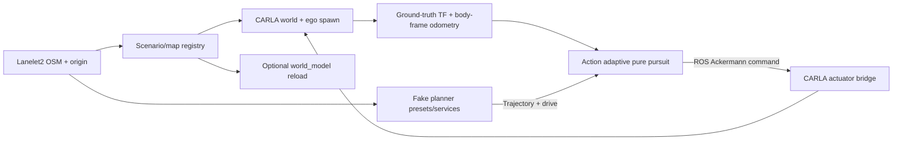

# Controller SIL: current scope and implementation

## Scope

The first milestone has two tasks: inject trajectories into the existing motion
controller, and switch scenarios with matching CARLA/Lanelet2 maps while keeping
containers and ROS processes running. Perception cameras, general actor editing,
full-stack orchestration, fault injection and automated pass/fail scoring remain
future work. The broad [interactive SIL PRD](CARLA_INTERACTIVE_SIL_PRD.md) is a
backlog; this document defines the current scope.

A running simulation is not proof that the controller works. This milestone
provides the environment and inputs for an interactive controller experiment.
Actual tracking error, stopping distance and vehicle behavior still need to be
measured against CARLA dynamics.

## What the controller receives

`ackermann_pure_pursuit` consumes `wato_trajectory_msgs/msg/Trajectory` on
`/action/trajectory_planning/trajectory`. Its header names `map`; each ordered
point contains a pose and `max_speed` in **m/s**. There are no point timestamps.
The fake planner also publishes `behaviour_msgs/msg/ExecuteBehaviour` with
`drive`, because pure pursuit expects a behavior command as well as a trajectory.
Stopping clears the trajectory and requests `standby` with a zero standby speed.



The simulation does not decide which autonomy containers run. Start action
independently using its simulation launch. Real planning nodes must be disabled
while the fake planner owns the trajectory topic. Full world-model launches that
include behavior or SLAM can introduce competing behavior/TF publishers; the
optional `map_sim.launch.yaml` starts only the map consumer and visualization.

## Files to configure

| Purpose | File |
|---|---|
| Scenario IDs, Python modules, map sources, OSM origins and track spawn | `carla_ros_bridge/carla_scenarios/config/scenarios.yaml` |
| Named trajectory presets and speed profiles | `carla_ros_bridge/carla_fake_planner/config/trajectories.yaml` |
| Controller tuning and zero standby speed | `../action/action_bringup/config/action_sim.yaml` |
| Interactive services and path preview | `../../config/foxglove_config/carla_sil.json` |

Registry paths are relative to `maps_root`, default `/opt/watonomous/maps`.
`scenario_registry` and `maps_root` are launch arguments. Scenario code owns
actor layout; the registry selects its map bundle. A geographic origin is the
projection reference, **not** the vehicle's spawn. Track spawn is separately
specified as a lanelet ID, distance along its centerline, and height.

The registry supports exactly one CARLA source per map:

- `built_in_map: Town10HD`
- `from_lanelet2: true`, using the canonical OSM and a generated XODR cache
- `xodr_path: ring_road/ring_road.xodr`, with matching OSM and projection metadata

The track converter supports flat, directed, constant-width parallel closed
tracks with shared boundary endpoints. It rejects unsupported branching,
merges, lane-count changes, crossing reference roads, regulatory elements and
non-geographic coordinates. It is not a general Lanelet2 road-network converter.
CARLA's ordinary OSM converter expects highway ways; it does not supply this
Lanelet2 relation conversion. Existing ordinary OSM tooling remains separate.

## Prepare maps

Run Docker builds, ROS container commands and simulator validation on the cloud
simulation host. The laptop is for editing and lightweight file/geometry checks.
Copy the map assets to the cloud checkout before using the commands below.

From the cloud repository root, with Docker available:

```bash
watod_scripts/watod-map.sh ~/Downloads/oval.osm maps/oval \
  --origin-lat 45.5017 --origin-lon -73.5673 \
  --map-id oval --spawn-lanelet 10000 --spawn-distance 5
```

The origin above is the chosen reference for the supplied oval. The tool writes
`oval.osm`, `oval.xodr`, and `map.yaml`. Use `--force` to regenerate existing
outputs. Merge `map.yaml` into the registry's `maps` section for a new track.
For runtime `from_lanelet2`, only OSM plus YAML is needed; XODR is cached under
`maps/.cache` and regenerated when the source, origin or converter changes.

The Town10HD registry entry also needs `maps/osm/Town10HD.osm`. These are local
assets ignored by Git. The existing oval and Town10HD from Downloads were copied
there in the local checkout during development; these ignored assets must also
be copied to the cloud checkout. A fresh checkout must supply its own maps.

Custom maps are parsed by CARLA and sampled for centerline/heading alignment
before outgoing actors are destroyed. This is an offline geometry check; a
successful parser result does not verify Unreal mesh generation or driving.
GNSS projection alignment has not been validated.

## Run a controller experiment

On the cloud host, build the changed simulation and action images/packages
before starting. New
ROS messages require rebuilding their consumers.

```bash
./watod -m simulation up
```

Use a sourced ROS terminal in `simulation_bringup`, or the corresponding Call
Service panels in `config/foxglove_config/carla_sil.json`:

```bash
ros2 service call /carla/scenario_server/switch_scenario \
  carla_msgs/srv/SwitchScenario "{scenario_name: fake_planner}"
```

Wait for `/carla/scenario_server/scenario_status` to say `running`. Then start
an action instance with its real planners disabled. Avoid a second action launch
publishing to the same command or trajectory topics:

```bash
./watod -m action run --rm --no-deps action_bringup \
  ros2 launch action_bringup action_sim.launch.yaml enable_planning:=false
```

Select a preset without resetting the ego:

```bash
ros2 service call /carla/carla_fake_planner/select carla_msgs/srv/SelectTrajectory \
  "{trajectory_id: follow_lane, parameters_yaml: 'speed_kph: 20.0'}"

ros2 service call /carla/carla_fake_planner/select carla_msgs/srv/SelectTrajectory \
  "{trajectory_id: snake, parameters_yaml: '{amplitude_m: 0.8, wavelength_m: 20.0}'}"

ros2 service call /carla/carla_fake_planner/select carla_msgs/srv/SelectTrajectory \
  "{trajectory_id: hard_brake, parameters_yaml: '{speed_kph: 50.0, brake_start_m: 40.0, brake_distance_m: 2.0}'}"
```

Services return success/error details. `get_available` lists IDs and the YAML
catalog. Unknown parameters, invalid speeds and unsuitable poses are rejected
without replacing the current run.

| Preset | Behavior |
|---|---|
| `follow_lane` | Current lane's connected centerline, rolling forward window, repeated laps until replaced/stopped |
| `snake` | Finite sinusoidal lateral offsets around the current lane, customizable wavelength/amplitude and interpolated speed knots, zero-speed tail |
| `hard_brake` | Lane centerline with a spatial speed drop, default 30 km/h to zero; set 50 km/h or `brake_distance_m: 0.0` for a step |

Speed knots are `{distance_m, speed_kph}` entries relative to the selection
point. Geometry and speed values are repeatedly published at 20 Hz. Finite
runs remain selected until completed, stopped or replaced. A new selection uses
the current pose. Follow-lane/brake follow the nearest compatible centerline;
snake blends the initial lateral offset back into its authored path.

Pure pursuit applies its own lookahead and steering-related speed reduction.
A 50 km/h preset is a requested speed profile, not a promise that the car reaches
50 km/h. Brake distance specifies where the requested speed changes, not a
physical stopping-distance guarantee. The simulation speed cap is 14 m/s.

Stop and reset are separate operations:

```bash
ros2 service call /carla/carla_fake_planner/stop std_srvs/srv/Trigger '{}'
ros2 service call /carla/scenario_server/reset_ego std_srvs/srv/Trigger '{}'
```

Reset clears the selected trajectory, brakes/teleports the ego to its configured
spawn, zeros velocity and waits for fresh localization. Select another
trajectory afterward. `/carla/carla_fake_planner/path` previews the full finite path
(or one lap); `/carla/carla_fake_planner/status` reports state/progress/error as JSON.

## Switching and failure behavior

A switch validates the requested bundle/plugin before teardown, clears fake
planner input, waits for controller idle if action is present, brakes the ego,
and cleans up bridge lifecycle resources. It then loads/generates the CARLA
world, spawns the new ego, rebinds sensors/localization/control, waits for fresh
odometry and reloads the optional world_model with the selected OSM/origin.
Only then does status become `running` and actuator commands become acceptable.
Queued commands from before readiness or a previous clock epoch are rejected.

Processes and containers survive the operation. Sensor/odometry publication has
a gap while actors and lifecycle resources are replaced. CARLA simulation time
may reset when a world loads; consumers must use simulation time and tolerate
that reset. The scenario/status service remains available through the switch.
A post-teardown failure brakes and pauses the environment with `error` status;
retry a scenario switch after correcting the cause. Preflight errors retain the
current environment.

An independently launched `/world_modeling/world_model` is discovered and its
map parameters reconciled. A mismatch after a rapid restart is also detected.
For a map-only consumer, launch:

```bash
./watod -m world_modeling run --rm --no-deps world_modeling_bringup \
  ros2 launch world_modeling_bringup map_sim.launch.yaml
```

## Verification and remaining acceptance checks

Completed during development:

- Ten portable geometry/trajectory regressions, including multiple laps,
  speed units, brake steps/ramps, invalid input and road seam continuity.
- Four native ROS regressions with mocked CARLA actors: message contracts,
  pause/generation clearing, world-model parameter reload/restart detection,
  and C++ nested startup/repeated bridge transitions/failure propagation.
- ROS interface and lifecycle compilation in a cached ROS Humble container.
- CARLA **0.10.0** offline parsing/alignment of the supplied oval: 940 samples,
  maximum refined centerline error **0.0759 m**. CARLA's approximate nearest
  lookup is refined locally through its exact OpenDRIVE API for this check.

This does **not** establish completed SIL. Before accepting the milestone on
the target Jazzy/CARLA host:

1. Build the target images and load the oval in the running Unreal server.
2. Drive at least two complete follow-lane laps and check direction/alignment.
3. Replace follow-lane with snake while moving; verify the new path starts at
   the current location and speed knots reach the controller in m/s.
4. Run 30-to-zero and 50-to-zero profiles; record achieved speed, stopping
   distance and controller behavior, including a zero-distance speed step.
5. Reset during a run and while paused; verify zero input, fresh localization,
   configured spawn, and that selecting again works.
6. Switch Town10HD → oval → Town10HD with action and optional world_model alive;
   verify unchanged process IDs, correct map/origin, fresh TF/odom/sensors and
   command gating. Repeat a same-scenario reload and a world_model restart.
7. Try missing/misaligned maps and failed bridge activation; check retained
   environment before teardown, or braked `error` state after teardown.

Portable tests: `python3 -m unittest discover -s src/simulation/tests -v` with
PyYAML installed. The ROS tests skip outside a sourced workspace; to run them,
build/source `carla_lifecycle`, `carla_fake_planner`, and `carla_scenarios` first.
