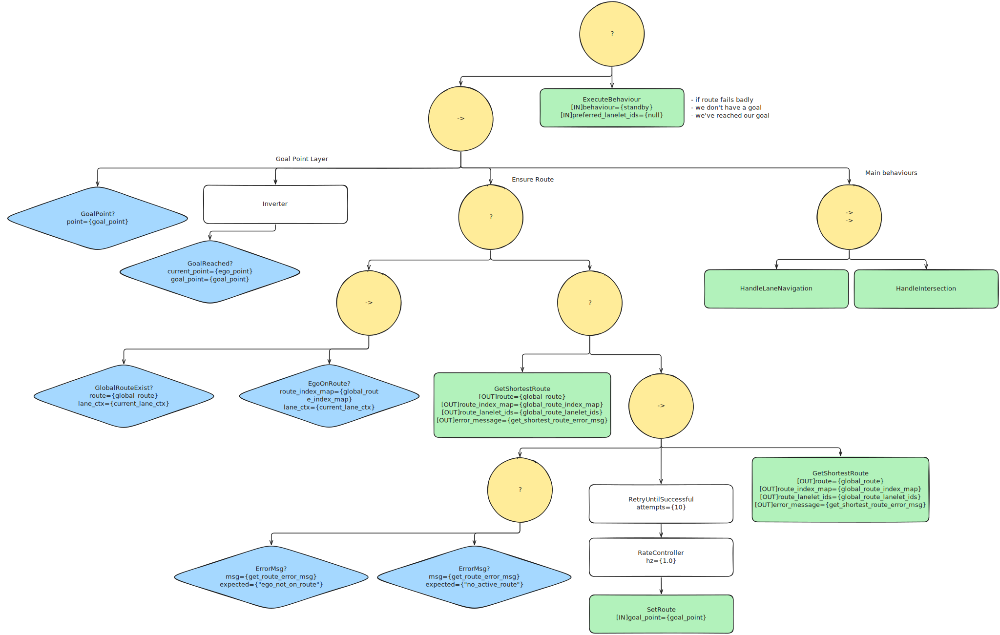
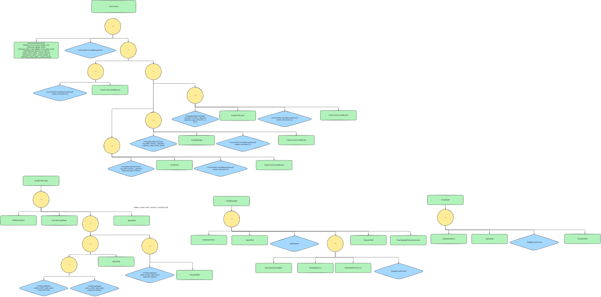
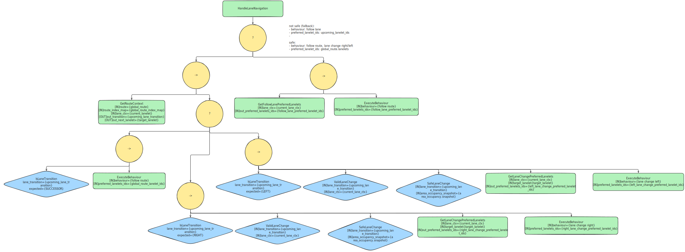

# Behaviour

Behavior tree for Eve's decision making using [BehaviorTree.CPP](https://www.behaviortree.dev/) and ros wrappers from [BehaviorTree.ROS2](https://github.com/BehaviorTree/BehaviorTree.ROS2).

## Overview

The three main behaviours the behaviour tree currently handles are:

- **Reaching goal point** (ensure global route, ensure car at goal)
- **Lane navigation** (following route, safe lane changes)
- **Intersection** (traffic light, stop sign, yield)

## Parameters

There is more comments and info under `/config/param.yaml`

| Parameter                                 | Type     | Default                        | Description                                                                    |
| ----------------------------------------- | -------- | ------------------------------ | ------------------------------------------------------------------------------ |
| `bt_tree_file`                            | string   | `main_tree.xml`                | Behavior tree XML file to load                                                 |
| `rate_hz`                                 | double   | 10.0                           | Tree tick frequency                                                            |
| `map_frame`                               | string   | `map`                          | Map frame ID                                                                   |
| `base_frame`                              | string   | `base_link`                    | Robot base frame ID                                                            |
| `traffic_light_state_hypothesis_index` | size_t      | 1                              | Hypothesis index for traffic light state                                       |
| `world_objects_hypothesis_index`          | size_t      | 0                              | Hypothesis index for object classification                                     |
| `bt.left_lane_change_areas`               | string[] | `[left_lane_change_corridor]`  | Area names for left lane change safety                                         |
| `bt.right_lane_change_areas`              | string[] | `[right_lane_change_corridor]` | Area names for right lane change safety                                        |
| `bt.intersection_wall_of_doom_width`      | double   | 5.0                            | Virtual wall width at stop lines (m)                                           |
| `bt.intersection_wall_of_doom_length`     | double   | 1.0                            | Virtual wall length at stop lines (m)                                          |
| `bt.stop_sign_ego_stop_line_threshold_m`  | double   | 3.0                            | Max ego distance from the stop line to accept the stop at a stop sign (m)      |
| `bt.ego_stopped_velocity_threshold`       | double   | 0.1                            | Velocity threshold for "stopped" (m/s)                                         |
| `bt.intersection_lookahead_m`             | double   | 100.0                          | Intersection detection lookahead (m)                                            |
| `bt.goal_reached_mode`                    | string   | `lanelet`                      | Goal distance source: `lanelet` endpoint or raw `point`                        |
| `bt.goal_reached_threshold_m`             | double   | 1.0                            | Distance to goal to consider reached (m)                                       |
| `service_timeout_ms`                      | int      | 6000                           | Global timeout for behaviour service calls (ms)                                |
| `wait_for_service_timeout_ms`             | int      | 60000                          | Max time to wait for required services during BT startup (ms)                  |
| `enable_console_logging`                  | bool     | false                          | Enable BT console logging                                                      |

## Topics

### Subscribed

| Topic            | Type                                  | Description                       |
| ---------------- | ------------------------------------- | --------------------------------- |
| `goal_point`     | `geometry_msgs/PointStamped`          | Goal position                     |
| `ego_odom`       | `nav_msgs/Odometry`                   | Ego pose and twist                |
| `lane_context`   | `lanelet_msgs/CurrentLaneContext`     | Current lane information          |
| `world_objects`  | `world_model_msgs/WorldObjectArray`   | Tracked world objects (enriched)  |
| `area_occupancy` | `world_model_msgs/AreaOccupancyArray` | Occupancy status of defined areas |

### Published

| Topic               | Type                                  | Description                                                                                                               |
| ------------------- | ------------------------------------- | ------------------------------------------------------------------------------------------------------------------------- |
| `execute_behaviour` | `behaviour_msgs/ExecuteBehaviour.msg` | Sends lattice planner the message to execute the accurate behaviour and the preferred lanelets that the car should be on. |
| `speed_behaviour`   | `behaviour_msgs/SpeedBehaviour.msg`   | Publishes intersection speed advice and ego-relative distance to the upcoming intersection. |

## Services Called

Service names are set directly in the XML tree files (see [DEVELOPING.md](DEVELOPING.md)).

| XML `service_name`                         | Type                                 | Description                         |
| ------------------------------------------ | ------------------------------------ | ----------------------------------- |
| `/world_modeling/get_shortest_route`       | `lanelet_msgs/GetShortestRoute`      | Get route from ego to goal          |
| `/world_modeling/set_route`                | `lanelet_msgs/SetRoute`              | Set the active route                |
| `/world_modeling/get_area_occupancy`       | `world_model_msgs/GetAreaOccupancy`  | Get occupancy of defined areas      |
| `/world_modeling/get_world_objects_enriched` | `world_model_msgs/GetWorldObjectsEnriched` | Get all tracked world objects (enriched) |
| `/world_modeling/spawn_wall`               | `costmap_msgs/SpawnWall`             | Create virtual wall at stop lines   |
| `/world_modeling/despawn_wall`             | `costmap_msgs/DespawnWall`           | Remove virtual wall                 |

## Services Exposed

| Service Name                  | Type                 | Description                                                        |
| ---------------------------- | -------------------- | ------------------------------------------------------------------ |
| `/world_modeling/reset_bt`   | `std_srvs/Trigger`   | Clears costmap virtual walls, then rebuilds the BT and runtime blackboard state |

## Reset BT Service

The behaviour node exposes a `std_srvs/Trigger` service named `reset_bt`.

- Under `world_modeling_bringup`, the behaviour node runs in the `world_modeling` namespace, so the default resolved service name is `/world_modeling/reset_bt`.
- Under the standalone [behaviour.launch.yaml](launch/behaviour.launch.yaml), the node has no namespace, so the default resolved service name is `/reset_bt`.
- If the launch file remaps `reset_bt`, use the remapped service name instead.

Calling this service first requests `clear_walls` from the costmap node. If that succeeds, it rebuilds the behaviour tree from the installed XML and replaces the in-process blackboard. Static BT configuration is re-seeded immediately; runtime entries such as goal, route, lane context, and odometry are repopulated by the next incoming subscriber callbacks.

### From Terminal

```bash
ros2 service call /world_modeling/reset_bt std_srvs/srv/Trigger "{}"
```

Standalone launch:

```bash
ros2 service call /reset_bt std_srvs/srv/Trigger "{}"
```

### From Foxglove

Use the `Call Service` panel with:

- Service: `/world_modeling/reset_bt`
- Type: `std_srvs/srv/Trigger`
- Request:

```json
{}
```

## Intersection Notes

- `traffic_sign` regulatory elements are normalized into BT-level `STOP_SIGN` / `YIELD` types via `behaviour/utils/lanelet.hpp`.
- Stop sign and yield now use a shared `RegElemEgoPriority` latch to avoid wall flashing once ego has earned the turn but has not physically passed the regulatory element yet.
- If a stop/yield regulatory element has no usable `ref_line`, `GetLaneletEndPose` falls back to the midpoint of the current lanelet centerline.

## Tree Structure

The main tree (`main_tree.xml`) includes modular subtrees:

| Subtree               | Description                              |
| --------------------- | ---------------------------------------- |
| `lane_navigation.xml` | Lane following and lane change logic     |
| `intersection.xml`    | Intersection detection and routing       |
| `stop_sign.xml`       | Stop sign behavior (stop, wait, proceed) |
| `traffic_light.xml`   | Traffic light state handling             |
| `yield.xml`           | Yield sign behavior                      |

## Diagrams

### Root Tree



Source: [`docs/root.excalidraw`](docs/root.excalidraw)

### Intersections



Source: [`docs/intersections.excalidraw`](docs/intersections.excalidraw)

### Lane Navigation



Source: [`docs/lane_navigation.excalidraw`](docs/lane_navigation.excalidraw)
