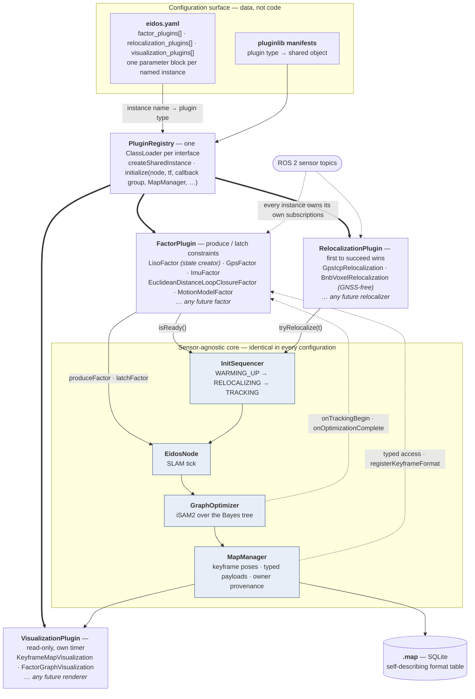
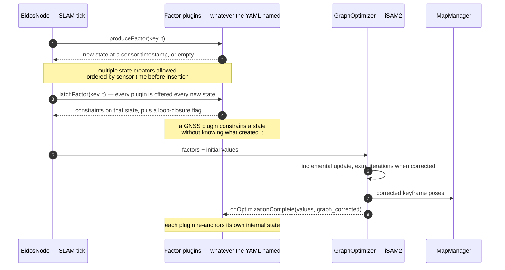
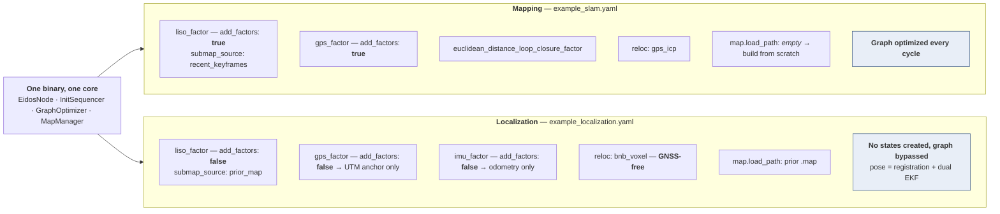

# Eidos: Academic Foundations and Implementation-Paper Scaffold

**Status:** working document for a systems/implementation paper on Eidos, the plugin-based
LiDAR-inertial SLAM and localization system in the WATonomous monorepo
(`src/world_modeling/eidos`, `src/world_modeling/eidos_transform`, `src/world_modeling/eidos_tools`).

---

## 0. The source papers

The first two PDFs are in the package root and have been read in full. The third is cited from
the published record; its PDF is not on disk.

| File | Paper | Role for Eidos |
|---|---|---|
| `2007.00258v3.pdf` | Shan, Englot, Meyers, Wang, Ratti, Rus. *LIO-SAM: Tightly-coupled Lidar Inertial Odometry via Smoothing and Mapping.* IROS 2020. | **The estimation ancestor.** Eidos's factor vocabulary, keyframe policy, sliding-window submap, and Euclidean loop closure are all recognizably LIO-SAM's. |
| `2310.10023` (not on disk) | Aoki, Koide, Oishi, Yokozuka, Banno, Meguro. *3D-BBS: Global Localization for 3D Point Cloud Scan Matching Using Branch-and-Bound Algorithm.* ICRA 2024. | **The global-localization ancestor.** The method the `BnbVoxelRelocalization` plugin adapts. Eidos follows its hierarchical voxel pyramid, sparse hashing, and roto-translational branching, but not its GPU batching; the Eidos implementation is CPU/OpenMP and independent of the `3d_bbs` library. |
| `2403.06341v1.pdf` | Labbé, Michaud. *RTAB-Map as an Open-Source Lidar and Visual SLAM Library for Large-Scale and Long-Term Online Operation.* Journal of Field Robotics, 2019 (arXiv preprint posted 2024). | **The architecture ancestor.** RTAB-Map is the precedent for treating a SLAM system as a *library of interchangeable parts* rather than a fixed pipeline, and for the mapping-then-localization mode switch. |

The single sentence that positions the paper:

> Eidos sits at the intersection of these two works. It adopts LIO-SAM's factor set and
> its incremental smoothing backend, and it adopts RTAB-Map's conviction that the parts of a
> SLAM system should be swappable at configuration time rather than compile time. Its
> contribution is to push RTAB-Map's decoupling one level deeper: where RTAB-Map makes
> *odometry* an external, interchangeable input, Eidos makes *every constraint in the factor
> graph* an external, interchangeable input.

Everything below is cross-checked against the Eidos source and against the deployed
configuration files, so the comparison numbers are the ones the system actually runs with, not
the header defaults.

---

## 1. Abstract

> **Primary draft (systems / implementation venue, ~200 words)**
>
> We present Eidos, a plugin-based LiDAR-inertial SLAM and localization system for ROS 2 in
> which the estimation backend is fixed and the measurement model is configuration. Like
> LIO-SAM, Eidos maintains a factor graph over SE(3) vehicle states and solves it incrementally
> with iSAM2, and its default constraint set (LiDAR odometry, GNSS position, loop closure)
> mirrors LIO-SAM's. Unlike LIO-SAM, none of that set is fixed in source. Following RTAB-Map's
> precedent of admitting odometry as an interchangeable external input, Eidos generalizes
> interchangeability to every constraint: runtime-loaded *factor plugins* participate in a
> two-phase contract each cycle, in which one plugin creates a graph state at a sensor timestamp
> and every other plugin is offered the chance to latch constraints onto it. Generalized ICP
> scan-to-submap matching, unary GNSS constraints, inertial preintegration, and Euclidean loop
> closure are all instances of one interface, as are prior-map relocalization and pose-graph
> visualization. The same plugin set, reconfigured rather than rebuilt, yields either mapping or
> map-based localization. Maps persist as self-describing SQLite databases in which every
> payload records its own codec, so offline tools read them without plugin code. We describe the
> architecture, the concurrency design that keeps registration off the optimizer's critical path,
> and deployment on a full-scale autonomous vehicle.

> **Alternate draft (shorter, for a workshop or robotics-software venue)**
>
> LiDAR-inertial SLAM systems are typically shipped as fixed pipelines. LIO-SAM introduces
> exactly four factor types and one variable type, all decided at compile time; adding a fifth
> means editing the estimator. RTAB-Map showed that at least one component, odometry, can be
> made an interchangeable external input. Eidos extends that argument to its conclusion. Its core
> is an iSAM2 pose-graph estimator that knows nothing about sensors, and all measurement
> semantics live in runtime-loaded plugins that either create graph states or latch constraints
> onto states other plugins created. We show that GICP scan-to-submap odometry, GNSS priors,
> IMU preintegration, and loop closure all fit this one interface, that mapping and localization
> differ only in plugin configuration, and that the system runs on a real autonomous vehicle with
> persistent maps and interchangeable prior-map relocalization.

---

## 2. General objective

**Objective statement, long form.**

The objective of this work is to design, implement, and deploy a LiDAR-inertial state
estimation system whose *estimation backend* and *sensor semantics* are separable, and to show
that this separation costs nothing in accuracy while removing the principal maintenance burden
of production SLAM: that adding, removing, or retuning a sensor modality means editing the
estimator.

Concretely, the work sets out to:

1. **Formalize the constraint contract.** Define a minimal interface through which an arbitrary
   sensor module can either declare that a new graph state should exist at a given sensor time,
   or attach a constraint to a state another module declared, without either module knowing the
   other exists.

2. **Show the contract is sufficient.** Demonstrate that this single interface expresses the
   constraint vocabulary LIO-SAM fixes in source: relative pose constraints from scan matching,
   unary global-position constraints from GNSS, inertial constraints from preintegrated IMU, and
   loop-closure constraints. Then demonstrate it expresses one LIO-SAM does not have, a
   dead-reckoned motion-model constraint sourced from a separate ROS node over a service call,
   as evidence that the interface is genuinely open rather than a refactor of a known list.

3. **Unify mapping and localization.** Following RTAB-Map's mapping-then-localization mode
   switch, show that the two are parameterizations of one plugin set rather than two code paths,
   and characterize precisely what changes between them.

4. **Make maps portable and inspectable.** Persist the graph, keyframe poses, per-keyframe
   sensor payloads, and graph adjacency into a single self-describing file that offline tooling
   can read without linking any plugin.

5. **Meet real-time constraints on a real vehicle.** Keep sensor ingestion, registration, and
   incremental optimization concurrent and lock-free on the hot path, and validate on-vehicle.

**Objective statement, one sentence, for the introduction.**

> Our objective is to show that the measurement model of a LiDAR-inertial SLAM system can be
> made a runtime configuration rather than a compile-time commitment, without sacrificing the
> incremental-optimization guarantees that make such systems real-time in the first place.

---

## 3. Theoretical foundations to establish in the paper

### 3.1 SLAM as maximum a posteriori inference on a factor graph

State the estimation problem in the standard form, the same one LIO-SAM Section III-A states.
Let the trajectory be

$$\mathcal{X} = \{x_0, x_1, \dots, x_n\}, \qquad x_i \in SE(3)$$

and let $\mathcal{Z} = \{z_k\}$ be all measurements. Under conditionally independent measurements
with additive zero-mean Gaussian noise, the posterior factorizes:

$$p(\mathcal{X} \mid \mathcal{Z}) \;\propto\; p(\mathcal{X}) \prod_k p(z_k \mid \mathcal{X}_k)$$

where $\mathcal{X}_k \subseteq \mathcal{X}$ is the small subset of states measurement $z_k$
depends on. That factorization *is* the factor graph. Maximizing the posterior is equivalent to
nonlinear least squares:

$$\mathcal{X}^\star \;=\; \arg\min_{\mathcal{X}} \;\sum_k \big\lVert h_k(\mathcal{X}_k) \ominus z_k \big\rVert^2_{\Sigma_k}$$

LIO-SAM makes exactly this move and cites it as the reason a factor graph is preferable to a
Bayes net for inference. Cite Lu and Milios for the original pose-graph formulation, Grisetti et
al. for the tutorial treatment, Dellaert and Kaess for the factor-graph framing, and Cadena et
al. for survey positioning.

**Why this matters for Eidos specifically.** The factor graph is the abstraction that makes the
plugin architecture possible. Because the posterior is a *product* of independent factors, a
module contributing $\phi_k$ needs to know nothing about any $\phi_j$. LIO-SAM already observes
that its framework "can also incorporate measurements from other sensors, such as elevation from
an altimeter or heading from a compass" without loss of generality. That sentence is the opening
Eidos walks through: LIO-SAM notes the extensibility is mathematically available, and Eidos makes
it *architecturally* available. Quote that line in the introduction. It is the cleanest possible
setup for the contribution.

### 3.2 State representation on the manifold

Poses are elements of $SE(3)$, so error needs care. Eidos uses GTSAM's `Pose3` and expresses
residuals in the tangent space $\mathfrak{se}(3)$ via the logarithm map:

$$x_i \ominus x_j \;\triangleq\; \mathrm{Log}\!\left(x_i^{-1} x_j\right) \in \mathbb{R}^6$$

Increments live in $\mathbb{R}^6$ and are retracted with $\mathrm{Exp}$. Cite Solà et al. and
Barfoot. Short section, but a reviewer will notice its absence.

One implementation consequence worth a footnote: covariance vectors in Eidos configuration files
are ordered $[x, y, z, \text{roll}, \text{pitch}, \text{yaw}]$ for readability, and the code
permutes them into GTSAM's $[\text{rotation}, \text{translation}]$ tangent ordering at
construction. Mismatched noise-model ordering is a classic silent failure in pose-graph systems.

### 3.3 Incremental inference: iSAM2 and the Bayes tree

Batch re-solution at every keyframe is not real-time. Both source papers converge on the same
answer. LIO-SAM optimizes the graph "upon the insertion of a new node using incremental smoothing
and mapping with the Bayes tree (iSAM2)." RTAB-Map integrates three optimizers, TORO, g2o, and
GTSAM, and reports that GTSAM is now its default because it converges faster than TORO and is
more robust than g2o to multi-session merging. Eidos uses GTSAM's ISAM2 directly, so it inherits
the same choice both papers arrived at independently. That convergence is worth one sentence in
related work.

The two ISAM2 knobs Eidos exposes map onto the theory:

| Parameter | Deployed value | Meaning in iSAM2 terms |
|---|---|---|
| `relinearize_threshold` | 0.01 | Tangent-space delta above which a variable's linearization point is recomputed. |
| `relinearize_skip` | 1 | Updates that may elapse before relinearization is considered. |

Eidos additionally varies the *number* of update iterations by event class: a nominal count per
cycle, more when a GNSS correction enters, more again when a loop closure enters. This responds
to a real property of incremental optimization. A loop closure displaces the linearization point
far enough that one Gauss-Newton step on the old linearization is a poor approximation. Neither
source paper describes such a policy explicitly, so presenting it as a deliberate,
event-conditioned convergence schedule is a small but genuine reportable.

Also note that marginal covariances come from the Bayes tree rather than from inverting an
information matrix, and that Eidos treats failure to recover them as non-fatal.

### 3.4 The factor vocabulary, stated formally

Give each factor its residual. This section makes the plugin architecture concrete.

**Prior factor**, anchoring gauge freedom on the first state:

$$r_{\text{prior}} = \mathrm{Log}\!\left(x_0^{-1}\, \bar{x}_0\right)$$

Eidos anchors at either the relocalized pose or a gravity-aligned origin. Without it the graph is
rank-deficient by six degrees of freedom.

**Between factor from scan-to-submap registration:**

$$r_{ij} = \mathrm{Log}\!\left( \big(\bar{z}_{ij}\big)^{-1} x_i^{-1} x_j \right), \qquad \bar{z}_{ij} = \hat{x}_i^{-1}\hat{x}_j$$

This is LIO-SAM's Eq. 12, $\Delta T_{i,i+1} = T_i^{\mathsf{T}} T_{i+1}$, in tangent-space residual
form. It is the workhorse constraint and the only state-creating one in the deployed
configuration.

**Unary GNSS factor:**

$$r_{\text{gps}} = t(x_i) - z_i^{\text{map}}, \qquad z_i^{\text{map}} = R_{\text{map}}^{\text{ENU}}\, p^{\text{UTM}} - b$$

Three-dimensional, translation-only, with $b$ the UTM-to-map offset and
$R_{\text{map}}^{\text{ENU}}$ a yaw-only rotation fixed at initialization from IMU heading.

**Preintegrated inertial factor.** Cite Forster et al. for the theory: preintegrate raw IMU
between keyframes into a bias-parameterized relative motion increment
$(\Delta \tilde{R}_{ij}, \Delta \tilde{v}_{ij}, \Delta \tilde{p}_{ij})$ independent of the
linearization point, so relinearization does not force reintegration. LIO-SAM reproduces these as
its Eqs. 7 to 9.

**This is where Eidos and LIO-SAM genuinely diverge, and the paper must say so plainly.**
LIO-SAM's state vector is

$$\mathbf{x} = [\,\mathbf{R}^{\mathsf{T}},\; \mathbf{p}^{\mathsf{T}},\; \mathbf{v}^{\mathsf{T}},\; \mathbf{b}^{\mathsf{T}}\,]^{\mathsf{T}}$$

carrying rotation, position, velocity, and IMU bias, and the paper states that "the IMU bias is
jointly optimized alongside the lidar odometry factors in the graph." That joint estimation is
the entire content of the word *tightly-coupled* in LIO-SAM's title.

Eidos's graph carries pose only. Its IMU plugin preintegrates with GTSAM's
`PreintegratedImuMeasurements` but then projects the result to a pose-only `BetweenFactor`, using
the top-left $6 \times 6$ block of the preintegration covariance, because there are no velocity or
bias variables to attach to. The consequences, stated exactly:

- Accelerometer and gyroscope biases are not estimated online.
- Velocity is not observable from the graph.
- The coupling is loose in LIO-SAM's own sense of the term.

Two further facts of deployment belong in the same paragraph. First, the IMU factor plugin is
**not enabled in the shipped mapping configuration** at all; the mapping plugin list is GNSS,
LiDAR odometry, and loop closure. Second, in the shipped localization configuration the IMU
plugin is loaded but with constraint injection disabled, so it functions purely as an odometry
publisher. Inertial data does reach the estimator, but through the front end rather than the
graph: gyroscope integration seeds the GICP initial guess, and stationary IMU orientation
establishes the gravity-aligned origin.

Presenting this as a scoped staging decision with a named cost is far stronger than glossing it.
The extension is unambiguous and should be stated as future work: introduce $v_i \in \mathbb{R}^3$
and $b_i \in \mathbb{R}^6$ variables with `CombinedImuFactor` and bias random-walk factors, at
which point Eidos's inertial coupling becomes LIO-SAM's.

**Loop-closure between factor.** Structurally identical to the odometry between factor but
between temporally distant states, with its own covariance. Being non-sequential is what lets it
redistribute accumulated drift.

**Motion-model between factor.** A constant-velocity dead-reckoning constraint obtained by
integrating the local EKF's velocity over the inter-keyframe interval with the exponential map,
$\Delta x = \mathrm{Exp}(\xi \Delta t)$, with covariance scaled linearly in $\Delta t$. This has
no counterpart in either source paper, and it is the best single piece of evidence that the plugin
interface is genuinely open: the constraint originates in a *different ROS node*, arrives over a
service call, and enters the graph through exactly the same interface as a LiDAR constraint.
Lead with this example when defending the contribution.

### 3.5 Point cloud registration: three different answers

The front ends of Eidos and the two source papers differ, and the comparison is clean enough to
tabulate.

| System | Registration primitive | Target |
|---|---|---|
| LIO-SAM | LOAM-style edge and planar feature extraction by local roughness, Gauss-Newton on point-to-line and point-to-plane distances (its Eqs. 10, 11) | Voxel map of 25 recent sub-keyframes |
| RTAB-Map | ICP via libpointmatcher, point-to-point or point-to-plane | Last keyframe (S2S) or assembled point cloud map (S2M) |
| Eidos | Generalized ICP over full downsampled clouds via `small_gicp` | Submap of recent keyframes, or prior-map keyframes by radius query |

State the GICP objective:

$$T^\star = \arg\min_T \sum_i d_i^\top \big(C_i^B + T\, C_i^A\, T^\top\big)^{-1} d_i, \qquad d_i = b_i - T a_i$$

where $C_i^A, C_i^B$ are local surface covariances from each point's $k$-nearest neighbors. This
plane-to-plane formulation is what makes GICP robust to the sparse, anisotropic sampling of a
spinning LiDAR. Cite Segal et al. for GICP, Besl and McKay for the ICP ancestor, and Koide's
`small_gicp` for the parallel implementation Eidos links, with VGICP for the voxelization lineage.

Note that LIO-SAM explicitly acknowledges ICP and GICP as usable alternatives and says it chose
LOAM features "due to its computational efficiency and robustness in various challenging
environments." Eidos makes the opposite trade, buying dense-cloud robustness with parallel GICP
rather than feature sparsity. Say so directly; it is a defensible engineering choice given a
16-thread budget, and the evaluation can measure it.

Three further registration design points in Eidos:

1. **Scan-to-submap, not scan-to-scan.** Both source papers reach the same conclusion. LIO-SAM
   marginalizes old scans and matches against a fixed-size sliding window of sub-keyframes rather
   than a global map, and reports this as a primary reason it achieves real time where LOAM's
   dense global voxel map does not. RTAB-Map's S2M is the same idea. Eidos assembles from either
   the recent keyframes or, in localization, from prior-map keyframes retrieved by KD-tree radius
   query.

2. **Gyroscope-seeded initial guess.** Rotation integrated from the gyro between scans seeds the
   GICP guess, translation held at the last matched position. This is the same role LIO-SAM's IMU
   prediction $\tilde{T}_{i+1}$ plays and the same role RTAB-Map's Motion Prediction block plays,
   reduced to its cheapest useful form. RTAB-Map is emphatic that ICP *requires* a valid motion
   prediction; Eidos agrees in practice.

3. **Gravity-aligned initialization.** Tracking does not begin until the IMU has been observed
   stationary for a configured number of samples, at which point averaged orientation quaternions,
   hemisphere-corrected before averaging, yield a roll and pitch initial attitude. Yaw is left at
   zero because a consumer-grade IMU does not observe it reliably. Note that LIO-SAM reports LIOM
   failing entirely on its Rotation dataset because it inherits visual-inertial initialization
   sensitivity. Initialization robustness is a real differentiator and worth measuring.

### 3.6 Loop closure and its risks

Eidos detects candidates by Euclidean radius over the keyframe KD-tree subject to a minimum
temporal separation, verifies geometrically with GICP, and accepts above an inlier-ratio
threshold. This is LIO-SAM's method, and LIO-SAM's own framing should be quoted: it describes its
approach as "a naive but effective Euclidean distance-based loop closure detection approach" and
notes the framework "is compatible with other methods for loop closure detection, for example,
[those which] generate a point cloud descriptor and use it for place recognition." Eidos inherits
both the method and the caveat.

Deployed parameters side by side:

| Quantity | LIO-SAM | Eidos (mapping config) |
|---|---|---|
| Candidate search radius | 15 m | 20 m |
| Temporal separation gate | not parameterized in the paper | 80 s |
| Neighbors forming the candidate submap | m = 12 either side | up to 15, collected by graph BFS within 25 m |
| Verification | scan matching, world frame | GICP, candidate body frame, inlier ratio at least 0.3 |

Two Eidos implementation choices here are genuinely interesting and belong in the paper.

- **The source cloud is deliberately not a submap.** The candidate side is an assembled submap;
  the source side is the raw body-frame scan. The reason, recorded in the code, is that if both
  sides were assembled from graph-derived poses the registration would tend to confirm the current
  estimate rather than discover the drift it exists to correct. Note the relationship to LIO-SAM
  here precisely, because it is subtle. LIO-SAM discusses exactly this alternative in its Section
  III-C, observing that transforming sub-keyframes into the frame of $x_i$ yields the true relative
  transform directly, but chooses the world-frame formulation instead for computational reuse.
  Eidos takes the option LIO-SAM names and declines. That is a documented, attributable divergence,
  which is the best kind.

- **Verification runs off the optimizer thread.** Candidate search is synchronous in the latch
  phase; GICP verification is dispatched to a worker and delivered on a later cycle. This keeps a
  multi-hundred-millisecond registration off a 10 Hz loop. RTAB-Map makes the same architectural
  point about ORB-SLAM2 performing graph optimization in a separate thread to protect tracking
  frame rate.

**State the risk honestly, and note that one source paper already solved it.** Eidos adds
loop-closure constraints with a plain diagonal Gaussian noise model and no robust kernel, so a
single false positive is unbounded in effect. RTAB-Map addresses precisely this with a mechanism
Eidos could adopt almost verbatim: after optimization, if a link's transformation has changed by
more than a configured factor of its translational variance, all loop closure and proximity links
added by that node are rejected and the graph is kept as if no closure had occurred. That is a
cheap post-hoc consistency check requiring no change to the noise model. Cite it as the concrete
near-term remedy, and cite the M-estimator literature, switchable constraints, dynamic covariance
scaling, and graduated non-convexity as the principled alternatives.

### 3.7 Global reference frames

Geodetic fixes are converted to UTM, then into the map frame by a yaw-only rotation plus a
translation offset established on the first accepted fix, then persisted with the map and refined
at relocalization once GICP has produced a precise map-frame pose. The rotation is yaw-only
because the map frame is gravity-aligned by construction from IMU warm-up, leaving only heading to
reconcile. Note the standard caveat that UTM is a conformal projection with scale distortion away
from the central meridian, negligible at campus or city scale.

**Two gating policies worth comparing.** LIO-SAM states that it adds a GPS factor "only when the
estimated position covariance is larger than the received GPS position covariance," reasoning that
constant GPS injection is unnecessary because LiDAR-inertial drift grows slowly. Eidos declares a
`pose_cov_threshold` parameter and sets it in both configuration files, but **the parameter is
read and never used**; gating is instead by measured GNSS covariance against a maximum, and by a
minimum travel distance between accepted fixes. Verify this before writing, then either implement
the covariance gate or describe the distance gate as the deliberate policy. Do not describe a gate
the code does not apply.

**Elevation handling is a direct response to a problem LIO-SAM documents.** LIO-SAM reports GPS
altitude errors "approaching 100 m in our tests" and notes that loop closure is especially valuable
for correcting altitude drift when GPS is the only absolute sensor. Eidos can disable elevation
entirely by inflating $\sigma_z$ to a very large value rather than by defining a separate
two-dimensional factor type, keeping one factor type where a naive implementation needs two. Cite
LIO-SAM's altitude finding as the motivation; it turns an implementation trick into a
literature-grounded design decision.

### 3.8 Estimator decoupling: the dual-EKF transform layer

Eidos does not broadcast transforms or fuse odometry. A separate node runs two EKF instances of
the same pluginlib-loaded model: a local filter in the odom frame fusing only smooth sources, and
a global filter additionally fusing map-frame corrections. The correction is computed directly as

$$T_{\text{map}}^{\text{odom}} = T_{\text{map}}^{\text{base}} \big(T_{\text{odom}}^{\text{base}}\big)^{-1}$$

from both filter states in the same tick, sidestepping timestamp matching between a transform
lookup and a filter output.

Cite Moore and Stouch for the dual-filter pattern. Note that RTAB-Map publishes the same
`map` to `odom` correction and cites the same `robot_localization` package for multi-source
odometry fusion, so this is the established ROS convention rather than an Eidos invention. What
Eidos adds is **rewind-and-replay** for delayed map-frame measurements: snapshots of the global
filter are retained, and when a delayed pose arrives the filter is restored to the snapshot
preceding that timestamp and all subsequent measurements are re-sorted and replayed. This is a
bounded-history out-of-sequence measurement handler and is a legitimate systems contribution worth
naming as such.

---

## 4. Lineage: exactly what Eidos takes from each paper

### 4.1 Against LIO-SAM: same graph, different commitments

LIO-SAM's Section III-A is unusually explicit about its own closure: it introduces "four types of
factors along with one variable type." Eidos's default mapping configuration instantiates three of
those four, has the fourth available as a plugin, and adds a fifth that LIO-SAM does not have.

| Dimension | LIO-SAM | Eidos | Assessment |
|---|---|---|---|
| Variable type | One state node, $[\mathbf{R}, \mathbf{p}, \mathbf{v}, \mathbf{b}]$ | One state node, pose only | Eidos is strictly weaker. No online bias or velocity estimation. |
| Factor types | Four, fixed in source | Open set, loaded at runtime from configuration | The contribution. |
| Deployed factor set | IMU preintegration, LiDAR odometry, GPS, loop closure | LiDAR odometry, GPS, loop closure, plus motion model available | IMU factor exists but is not enabled for mapping. |
| Backend | iSAM2 | iSAM2 | Identical. |
| Optimizer scheduling | Optimize on node insertion | Optimize on node insertion, with extra iterations conditioned on correction or loop closure | Minor Eidos addition. |
| Front end | LOAM edge and planar features | GICP on downsampled full clouds | Deliberate divergence, measurable. |
| Keyframe policy | Pose change over threshold, 1 m and 10 degrees | Travel distance over threshold, 5 m, no rotation criterion | Eidos is coarser and has no rotation trigger. A pure yaw maneuver creates no keyframe. Worth an ablation and possibly a fix. |
| Local map for odometry | 25 sub-keyframes, world frame, voxelized at 0.2 m and 0.4 m | Up to 10 keyframes within 20 m, voxelized at 0.5 m | Eidos's window is smaller and coarser. |
| Loop closure detection | Euclidean, 15 m, m = 12 | Euclidean, 20 m, 80 s separation, up to 15 neighbors by graph BFS | Same family; Eidos adds an explicit temporal gate and graph-connectivity collection. |
| Loop closure submap frame | World frame, chosen for reuse efficiency | Candidate body frame, chosen to avoid confirming the prior estimate | Eidos takes the option LIO-SAM names and rejects. |
| GPS gating | Estimated covariance exceeds received covariance | Received covariance below a maximum, plus minimum travel distance | Divergent. Eidos's declared covariance threshold is unused. |
| GPS elevation | Discussed as unreliable, up to 100 m error | Optionally disabled by covariance inflation | Eidos operationalizes LIO-SAM's finding. |
| Registration covariance | From scan matching | Fixed values from configuration; the GICP Hessian and a `min_noise` floor are computed or declared but unused | Eidos is weaker. Deriving noise from registration quality is a clear improvement. |
| Map persistence | Not addressed | Self-describing SQLite database | Eidos addition. |
| Relocalization against a prior map | Not addressed | Two interchangeable plugins: GNSS-seeded coarse prior plus GICP refinement, and a GNSS-free branch-and-bound voxel search | Eidos addition. The second is integrated but does not yet lock; see limitation 10. |

The honest summary sentence: **Eidos is not more accurate than LIO-SAM and should not claim to
be. It is more extensible, it persists and reloads maps, and it relocalizes. Those are the claims
the evaluation must support.**

### 4.2 Against RTAB-Map: same philosophy, deeper cut

RTAB-Map's central architectural sentence is that "the odometry is an external input to RTAB-Map,
which means that SLAM can also be done using any kind of odometry to use what is appropriate for a
given application and robot." Eidos's contribution is best stated as a generalization of exactly
that sentence.

| Dimension | RTAB-Map | Eidos |
|---|---|---|
| What is interchangeable | Odometry, one external input | Every graph constraint, plus relocalization and visualization strategies. The relocalization half of that claim was aspirational when first written and is now backed by a second implementation added with no estimator, dependency, or map-format change |
| Constraint taxonomy | Three fixed link types: Neighbor, Loop Closure, Proximity | Open set; a plugin declares what it contributes |
| Extension mechanism | Configuration parameters over a fixed pipeline | Runtime class loading over a two-phase contract |
| Backend | Selectable among TORO, g2o, GTSAM; GTSAM default | GTSAM iSAM2 |
| Loop closure detection | Appearance-based, bag of visual words with a Bayes filter over hypotheses, plus geometric proximity detection | Geometric only, Euclidean radius with temporal gate |
| False-positive handling | Post-optimization link rejection when a transform moves beyond a variance factor | None |
| Bounded computation | Working Memory and Long-Term Memory with node transfer under a time or memory threshold | None; the graph grows without bound |
| Mapping versus localization | Explicit mode switch, motivated by static environments | Configuration difference, no mode flag |
| Multi-session | Supported, graphs merged on loop closure between sessions | Not supported |
| Map storage | Database, with sensor data compressed per node | SQLite file, self-describing per-payload codecs |
| Degeneracy handling | PCA-based structural complexity threshold on point cloud normals; when below it, only orientation is taken from ICP and position comes from external odometry | None |

Two rows in that table are the paper's most valuable gifts, because they are limitations of Eidos
for which a paper the authors already have supplies the answer.

**Memory management.** RTAB-Map's entire reason for existing is bounded-time operation, and its
Figure 18 shows update time crossing the real-time constraint without memory management and
staying under it with. Eidos has no equivalent, so its iSAM2 update cost grows monotonically with
session length. Do not cite generic graph-sparsification literature for this. Cite RTAB-Map's
Working Memory and Long-Term Memory mechanism directly, and report the measured growth curve.

**Degeneracy detection.** RTAB-Map computes the structural complexity of a cloud from the smallest
principal-component eigenvalue of its normals and, below a threshold, trusts ICP for orientation
only while taking position from external odometry. The motivating example is a featureless
corridor in which ICP can correct heading but cannot observe motion along the corridor axis. Eidos
has no such check; a GICP result is accepted on convergence and inlier count alone. For a
highway-speed vehicle in a tunnel or on an open road, this is the failure mode most likely to be
encountered in practice, and RTAB-Map hands over both the diagnostic and the mitigation.

### 4.3 The differentiation paragraph

Draft language for the end of related work:

> LIO-SAM demonstrates that a factor graph is the right structure for fusing LiDAR, inertial, and
> global measurements, and observes that its formulation admits further sensors without loss of
> generality. It does not, however, make that admission operational: its four factor types and one
> variable type are fixed in source, and a fifth constraint requires modifying the estimator.
> RTAB-Map demonstrates the operational value of interchangeability, but applies it to a single
> component, treating odometry as an external input while its own link taxonomy remains a fixed set
> of three. Eidos combines the two positions. It retains LIO-SAM's graph, backend, and constraint
> vocabulary, and it applies RTAB-Map's interchangeability not to odometry alone but to every
> contribution the graph receives.

---

## 5. Contributions, as they should appear in the introduction

1. **A two-phase constraint contract.** Each cycle proceeds in a *produce* phase, in which any
   plugin may declare a new graph state at a specific sensor timestamp, and a *latch* phase, in
   which every plugin is offered each newly created state and may attach constraints. State
   creation and constraint attachment are decoupled, so a GNSS module needs no knowledge of what
   created the state it constrains. Multiple state creators are supported and ordered by sensor
   time before insertion. Contrast directly with LIO-SAM, where the correspondence between the
   LiDAR keyframe and the state node is hard-coded.

2. **A uniform plugin taxonomy across the whole system.** Three interfaces, factor,
   relocalization, and visualization, cover every sensor-specific behavior including map-file
   serialization, which plugins register by data key and format name.

3. **Mapping and localization as one code path.** No mode flag exists. State the difference
   precisely, because the precise version is more interesting than the vague one. In the shipped
   mapping configuration, LiDAR odometry, GNSS, and loop closure all inject constraints and the
   graph is optimized every cycle. In the shipped localization configuration, **every** plugin has
   constraint injection disabled, so no states are created and the graph is bypassed entirely; the
   published pose comes directly from GICP registration against the prior map, and the dual EKF
   supplies fusion and smoothing. Localization is thus the degenerate configuration of the same
   plugin set, in which the estimator reduces to registration plus filtering. This is a stronger
   and more honest claim than asserting that both modes exercise the same graph, and it maps
   cleanly onto RTAB-Map's argument that switching to localization in a static environment saves
   both memory and map-management time.

4. **A gated initialization state machine with a plugin-driven readiness predicate.** The system
   leaves warm-up only when *every* loaded factor plugin reports readiness, generalizing the ad hoc
   "wait for IMU" logic in comparable systems into a property of the contract. LIO-SAM's report of
   LIOM failing to initialize on its Rotation dataset is the motivating citation.

5. **A self-describing map format.** Keyframe poses, per-keyframe binary payloads, graph adjacency
   with per-edge provenance, and global metadata in one SQLite file whose format table names the
   codec for every payload. External tooling deserializes everything without linking a plugin.
   Per-keyframe and per-edge owner fields make the graph auditable: you can ask which plugin
   produced any given constraint. Neither source paper offers this; RTAB-Map stores sensor data in
   a database but does not make the serialization self-describing.

6. **A concurrency design that keeps registration off the optimizer's critical path.** Sensor
   callbacks publish poses through a seqlock; the full optimized value set reaches visualization
   consumers by pointer swap; loop-closure verification and prior-map submap assembly run on
   workers with results delivered on later cycles. Corrections that must be applied to
   sensor-thread state are queued and consumed *by that thread*, avoiding a data race a direct
   write would introduce.

---

## 6. System architecture

The three figures below belong in the paper as Figure 1, and they are drawn to carry one argument:
**the core holds no sensor-specific knowledge, and every sensor-specific behaviour enters through
one of three interfaces resolved at run time from configuration.** Figure 1a is the static
structure, Figure 1b is the per-cycle contract that binds the two halves together, and Figure 1c
is the evidence that the contract, rather than a branch in the core, carries the behaviour.

### 6.1 Static structure

Read Figure 1a in three bands. The top band is the configuration surface, which is data and not
code. The middle band is the set of loaded plugin instances, which is whatever the configuration
named. The bottom band is the core, which is byte-identical across every configuration reported in
the paper.



Two properties of the figure are the contribution, and the caption should say both out loud.

**No edge carries raw sensor data between plugins.** Every instance owns its own subscriptions.
What instances share is the `MapManager` store, reached by typed key, and lock-free pose handles
read through a seqlock. The core never brokers measurements, so adding a sensor adds one node to
the middle band and changes nothing else in the figure.

**The only edges into the core are interface methods.** There is no path from a sensor to the
optimizer that does not pass through `produceFactor` or `latchFactor`. That is what makes the
middle band a set rather than a pipeline, and it is the difference from LIO-SAM, where the
correspondence between the LiDAR keyframe and the graph state is hard-coded.

### 6.2 The two-phase constraint contract

Figure 1b expands the single cycle that Figure 1a compresses into two edges. The separation of
*produce* from *latch* is the mechanism behind contribution 1, and it is easier to defend as a
message sequence than as prose.



Step 4 is the load-bearing one. Because every loaded plugin is offered every newly created state,
a constraint source needs no knowledge of the state's origin, and state creation is not the
privilege of a single sensor. Step 8 closes the loop in the other direction: corrections flow back
out through the same interface, so a plugin absorbs a graph correction into its own internal frame
without the core knowing what that frame is.

### 6.3 Interchangeability: one binary, two systems

Mapping and localization are not modes. No mode flag exists. They are two entries in a plugin
list, and Figure 1c is the whole of the difference between them.



State the degenerate case honestly, as section 5 item 3 already insists. In the shipped
localization configuration **every** loaded plugin has constraint injection disabled, so no states
are created and the optimizer is bypassed entirely; the published pose comes from registration
against the prior map, and the dual EKF supplies fusion and smoothing. Localization is the
configuration in which the estimator collapses to registration plus filtering. That is a stronger
and more honest claim than asserting that both modes exercise the same graph, and it is the claim
the figure actually supports.

Note also that the relocalization row changes without touching anything else. The GNSS-free
branch-and-bound relocalizer replaces the GPS-seeded one by editing one list entry, which is the
cleanest single demonstration of interchangeability available in the system.

### 6.4 The third axis: pluggable serialization

Configurability is usually argued at the algorithm level alone. Eidos extends it to the map file,
which is why the format registry appears in Figure 1a rather than in an appendix. A plugin
declares `registerKeyframeFormat(data_key, format)` during initialization; `MapManager` writes
that payload through the named codec and records the codec's name in the map file's format table.
External tooling therefore deserializes every payload without linking a single plugin. Combined
with the per-keyframe and per-edge owner fields, the map is auditable: any constraint in the graph
can be traced back to the plugin that produced it. Neither source paper offers this. RTAB-Map
stores sensor data in a database but does not make the serialization self-describing.

---

## 7. Implementation details worth reporting

- **Keyframe gating by distance.** A registration result is promoted to a graph state only after
  5 m of travel. Note explicitly that, unlike LIO-SAM's 1 m or 10 degree criterion, there is no
  rotation trigger, so a stationary yaw maneuver produces no new state.
- **Deferred, single-slot result caching.** The registration thread caches at most one pending
  result; back-pressure is handled by dropping rather than queueing, which is correct when the
  freshest measurement is the useful one.
- **Correction propagation to the odometry chain.** After optimization, the delta between a
  plugin's pre-optimization and corrected pose is queued and later composed into the incremental
  odometry accumulator, so odom-frame output stays continuous while absorbing graph corrections.
- **Submap staleness as an explicit state.** When a graph correction invalidates the submap,
  incoming scans are dropped rather than matched against a stale target, and a rebuild is
  triggered. A deliberate drop policy is more credible than implying the situation never arises.
- **Asynchronous prior-map submap rebuild with hysteresis.** In localization the submap is rebuilt
  when the vehicle leaves a fraction of the submap radius, on a worker, guarded against concurrent
  rebuilds.
- **Quaternion averaging done correctly.** Hemisphere alignment before summation during IMU
  warm-up, the omission of which silently ruins initialization.
- **Elevation locking by covariance inflation.** See section 3.7.
- **UTM offset refinement at relocalization.** The saved offset is corrected using the
  registration-derived pose, so successive sessions improve the geodetic anchor rather than
  inheriting the first session's error.
- **Write-ahead-log behavior of the map file.** Companion files exist while the database is open
  and merge on clean close. One line in a reproducibility section.

Report timing per stage. The loop-closure path already instruments source preprocessing, graph
traversal, submap assembly, and registration separately, which is publication material as it
stands. RTAB-Map's Figure 18, a stacked per-module timing plot against a real-time constraint line,
is the model to copy for presentation.

---

## 8. Evaluation protocol

Both source papers supply a protocol, and they differ usefully.

**Metrics.** RTAB-Map uses absolute trajectory error root-mean-square from the TUM benchmark, and
additionally argues for reporting ATE *maximum*, on the grounds that for autonomous navigation
what matters is how far the estimate can wander before localization recovers. That argument
applies directly to a road vehicle and the metric is cheap to add. LIO-SAM reports end-to-end
translation error, appropriate for closed-loop sequences. Report ATE RMSE, ATE max, and relative
pose error over several distance intervals; add KITTI-style translational and rotational drift per
unit distance if you want comparability with the wider literature. Use `evo` and say so.

**Ground truth.** RTK GNSS is the practical option for a vehicle. State antenna lever-arm handling
and the fix-quality distribution per sequence, because ATE against a degraded RTK solution is not
ground truth. Note that RTAB-Map had to align ground truth between two sessions by registering
assembled clouds and applying the resulting transform; if you run multi-session comparisons you
will face the same problem and should describe your solution.

**Baselines.** Run LIO-SAM itself. It is open source, its factor set is nearly yours, and a
side-by-side on your own sequences is the single most informative experiment available. LIO-SAM's
own comparison protocol is worth imitating: it forces the real-time methods to run in real time
while granting the slower baseline unlimited time, and reports that the latter achieved 0.56 times
real time. State your timing conditions with the same clarity.

**Ablations.** These make the architecture claim empirical rather than rhetorical, and the plugin
design makes each one a configuration file rather than a code branch. Say that explicitly in the
evaluation; it is itself evidence for the contribution. LIO-SAM's ablation naming scheme, odometry
only, then odometry plus GPS, then the full system, is a good template.

| Ablation | What it isolates |
|---|---|
| Gyro-seeded initial guess on or off | Registration convergence under fast rotation |
| GNSS factors on or off | Global drift correction versus local consistency |
| Loop closure on or off | Drift redistribution on revisit |
| Motion-model factor on or off | Value of cross-node dead-reckoning constraints |
| IMU factor enabled versus disabled | Whether the current pose-only projection earns its cost |
| Keyframe gate: distance only versus distance plus rotation | Whether LIO-SAM's rotation criterion matters at vehicle scale |
| Submap size and downsample resolution sweep | Accuracy against latency; compare against LIO-SAM's 25 keyframes at 0.2 and 0.4 m |
| Fixed versus event-conditioned ISAM2 iterations | Whether the extra loop-closure iterations pay |

**Localization-mode evaluation.** Time to relocalize from cold start, success rate over repeated
starts at varied positions, and steady-state ATE against the prior map. Report failures including
relocalization timeout. Once the branch-and-bound plugin locks, run this as a head-to-head against
the GNSS-seeded plugin and report the operational metric that motivated it: distance and wall-clock
time previously needed to acquire a usable GNSS fix, versus time to lock from a standstill.

**Computational characterization.** Per-stage latency distributions, not means: scan
preprocessing, GICP, ISAM2 update, submap rebuild. Then graph size and ISAM2 update time as
functions of session length, presented against a real-time constraint line in RTAB-Map's style.
This is where the absence of memory management will show, and reporting it honestly is better than
having a reviewer find it.

**Reproducibility.** Sensor suite and extrinsics, all configuration files, sequence descriptions,
and the map files. The self-describing map format is an asset here: the artifacts are readable
without the system that produced them.

---

## 9. Limitations to state explicitly

Each is real, visible in the code, and paired with a remedy from a paper already in hand.

1. **Inertial coupling is loose.** Preintegration is projected to a pose-only constraint; no
   velocity or bias variables exist, so bias and gravity are not estimated online, and the IMU
   factor is not enabled in the mapping configuration at all. *Remedy: LIO-SAM's state vector and
   joint bias estimation.*
2. **The graph grows without bound.** No marginalization, node transfer, or sparsification, so
   update cost grows with session length. *Remedy: RTAB-Map's Working Memory and Long-Term Memory
   with a time or memory threshold.*
3. **Loop closures are not robustified.** Plain Gaussian noise models, no M-estimator or switchable
   constraint, so one false positive is unbounded in effect. *Remedy: RTAB-Map's post-optimization
   link rejection, with the robust-kernel literature as the principled alternative.*
4. **No degeneracy detection.** A GICP result is accepted on convergence and inlier count alone,
   with no test for geometric observability. *Remedy: RTAB-Map's PCA structural-complexity
   threshold, falling back to orientation-only updates.*
5. **Registration covariance is fixed, not measured.** Noise models come from configuration; the
   GICP Hessian is computed but unused, and the declared minimum-noise floor is never applied.
   *Remedy: derive the noise model from registration quality, as both source papers do.*
6. **Loop-closure recall is geometric only.** Euclidean search cannot close a loop that drift has
   pushed outside the radius, precisely the case where closure matters most. *Remedy: RTAB-Map's
   appearance-based detection, or a LiDAR descriptor as LIO-SAM itself suggests.*
7. **Keyframe creation has no rotation criterion.** Compare LIO-SAM's 1 m or 10 degree rule.
8. **One loop-closure verification in flight at a time.** Bounds compute, but also bounds closure
   throughput in a dense revisit.
9. **Single-agent, single-session.** No multi-robot or multi-session graph merging, which RTAB-Map
   supports and identifies as a core practical requirement.
10. **Global relocalization is implemented but not yet validated.** Two plugins ship: GNSS-seeded
    registration, and a branch-and-bound voxel search needing no positional prior, listed second
    behind GNSS in the localization config and absent from the mapping config. The second does not
    yet lock on the validation map: the true yaw ranks 5th of 36 sampled yaws under occupancy
    scoring and 7th to 14th under the distance field, which is the shipped default and was the
    intended fix. Two independent scorers failing identically implicates the scene, a tree-lined
    route whose 0.6-6.0 m band is near space-filling at 1 m resolution, where a randomly rotated
    scan already hits 76% of query points. *Remedy: select the height band for discriminability,
    or score sparse structure within it rather than raw occupancy.* Descriptor-based place
    recognition remains absent from both plugins.
11. **Geodetic anchoring assumes a locally flat, gravity-aligned map with yaw-only reconciliation.**
    Valid at the target scale; state the scale.

---

## 10. Suggested paper structure

1. **Introduction.** The problem is not accuracy, it is modifiability. Open with LIO-SAM's own
   observation that its framework admits further sensors without loss of generality, and ask what
   it would take to make that operational. Contributions as in section 5.
2. **Related work.** Three strands: LiDAR-inertial odometry and SLAM systems, anchored on LIO-SAM;
   factor-graph backends and incremental inference; and modular, extensible robotics software,
   anchored on RTAB-Map. The third strand is where you differentiate and is the one most papers in
   this area neglect. Close with the differentiation paragraph in section 4.3.
3. **Preliminaries.** Sections 3.1 to 3.3, compressed.
4. **System architecture.** Plugin taxonomy, two-phase contract, lifecycle state machine,
   concurrency model. The per-cycle sequence diagram is the figure the paper turns on.
5. **Factor plugins.** Each with its residual and implementation specifics.
6. **Mapping versus localization as configuration.** Section 5, item 3, with the honest
   characterization.
7. **Map representation and persistence.** Schema, format registry, provenance fields, offline
   tooling.
8. **The transform layer.** Dual EKF, direct correction computation, rewind-replay.
9. **Experiments.** Section 8, with LIO-SAM as the primary baseline.
10. **Limitations and future work.** Section 9, each paired with its named remedy.
11. **Conclusion.**

**Figures worth the space.**

- The factor graph with nodes colored by producing plugin. The system already emits exactly this as
  a visualization topic, provenance included, so the figure is a screenshot of a running system
  rather than a drawing. Say so in the caption. Compare with LIO-SAM's Figure 1, which draws its
  four factor types by hand.
- The per-cycle produce and latch sequence diagram.
- The lifecycle state machine.
- Trajectory overlays against RTK, mapping and localization modes, with LIO-SAM as a baseline
  trace.
- Per-stage latency distributions, and update time against graph size with a real-time constraint
  line, in RTAB-Map's Figure 18 style.
- A before-and-after loop-closure map render.

---

## 11. Bibliography

The primary sources, then the works they build on that the paper will need. Verify page and
volume numbers against publisher records before submission; entries are correct in author, title,
venue, and year.

```bibtex
% ---- Primary sources ----

@inproceedings{shan2020liosam,
  title={{LIO-SAM}: Tightly-coupled lidar inertial odometry via smoothing and mapping},
  author={Shan, Tixiao and Englot, Brendan and Meyers, Drew and Wang, Wei and
          Ratti, Carlo and Rus, Daniela},
  booktitle={IEEE/RSJ International Conference on Intelligent Robots and Systems (IROS)},
  pages={5135--5142}, year={2020},
  note={arXiv:2007.00258}
}

@article{labbe2019rtabmap,
  title={{RTAB-Map} as an open-source lidar and visual simultaneous localization and mapping
         library for large-scale and long-term online operation},
  author={Labb{\'e}, Mathieu and Michaud, Fran{\c{c}}ois},
  journal={Journal of Field Robotics}, volume={36}, number={2}, pages={416--446}, year={2019},
  note={arXiv:2403.06341}
}

% ---- Backend and factor-graph theory ----

@article{kaess2012isam2,
  title={{iSAM2}: Incremental smoothing and mapping using the {B}ayes tree},
  author={Kaess, Michael and Johannsson, Hordur and Roberts, Richard and
          Ila, Viorela and Leonard, John J. and Dellaert, Frank},
  journal={The International Journal of Robotics Research},
  volume={31}, number={2}, pages={216--235}, year={2012}
}

@article{kaess2008isam,
  title={{iSAM}: Incremental smoothing and mapping},
  author={Kaess, Michael and Ranganathan, Ananth and Dellaert, Frank},
  journal={IEEE Transactions on Robotics}, volume={24}, number={6}, pages={1365--1378}, year={2008}
}

@techreport{dellaert2012factor,
  title={Factor graphs and {GTSAM}: A hands-on introduction},
  author={Dellaert, Frank},
  institution={Georgia Institute of Technology},
  number={GT-RIM-CP\&R-2012-002}, year={2012}
}

@article{dellaert2017factor,
  title={Factor graphs for robot perception},
  author={Dellaert, Frank and Kaess, Michael},
  journal={Foundations and Trends in Robotics},
  volume={6}, number={1-2}, pages={1--139}, year={2017}
}

@article{lu1997globally,
  title={Globally consistent range scan alignment for environment mapping},
  author={Lu, Feng and Milios, Evangelos},
  journal={Autonomous Robots}, volume={4}, number={4}, pages={333--349}, year={1997}
}

@article{grisetti2010tutorial,
  title={A tutorial on graph-based {SLAM}},
  author={Grisetti, Giorgio and K{\"u}mmerle, Rainer and Stachniss, Cyrill and Burgard, Wolfram},
  journal={IEEE Intelligent Transportation Systems Magazine},
  volume={2}, number={4}, pages={31--43}, year={2010}
}

@inproceedings{kummerle2011g2o,
  title={{g2o}: A general framework for graph optimization},
  author={K{\"u}mmerle, Rainer and Grisetti, Giorgio and Strasdat, Hauke and
          Konolige, Kurt and Burgard, Wolfram},
  booktitle={IEEE International Conference on Robotics and Automation (ICRA)},
  pages={3607--3613}, year={2011}
}

@article{cadena2016past,
  title={Past, present, and future of simultaneous localization and mapping:
         Toward the robust-perception age},
  author={Cadena, Cesar and Carlone, Luca and Carrillo, Henry and Latif, Yasir and
          Scaramuzza, Davide and Neira, Jos{\'e} and Reid, Ian and Leonard, John J.},
  journal={IEEE Transactions on Robotics}, volume={32}, number={6}, pages={1309--1332}, year={2016}
}

% ---- Inertial ----

@article{forster2017onmanifold,
  title={On-manifold preintegration for real-time visual-inertial odometry},
  author={Forster, Christian and Carlone, Luca and Dellaert, Frank and Scaramuzza, Davide},
  journal={IEEE Transactions on Robotics}, volume={33}, number={1}, pages={1--21}, year={2017}
}

% ---- Registration ----

@article{besl1992method,
  title={A method for registration of 3-{D} shapes},
  author={Besl, Paul J. and McKay, Neil D.},
  journal={IEEE Transactions on Pattern Analysis and Machine Intelligence},
  volume={14}, number={2}, pages={239--256}, year={1992}
}

@inproceedings{segal2009generalized,
  title={Generalized-{ICP}},
  author={Segal, Aleksandr and Haehnel, Dirk and Thrun, Sebastian},
  booktitle={Robotics: Science and Systems (RSS)}, year={2009}
}

@inproceedings{koide2021voxelized,
  title={Voxelized {GICP} for fast and accurate 3{D} point cloud registration},
  author={Koide, Kenji and Yokozuka, Masashi and Oishi, Shuji and Banno, Atsuhiko},
  booktitle={IEEE International Conference on Robotics and Automation (ICRA)},
  pages={11054--11059}, year={2021}
}

@article{koide2024smallgicp,
  title={{small\_gicp}: Efficient and parallel algorithms for point cloud registration},
  author={Koide, Kenji},
  journal={Journal of Open Source Software}, year={2024}
}

@article{pomerleau2013comparing,
  title={Comparing {ICP} variants on real-world data sets},
  author={Pomerleau, Fran{\c{c}}ois and Colas, Francis and Siegwart, Roland and Magnenat, St{\'e}phane},
  journal={Autonomous Robots}, volume={34}, number={3}, pages={133--148}, year={2013}
}

% ---- LiDAR odometry and SLAM systems ----

@inproceedings{zhang2014loam,
  title={{LOAM}: Lidar odometry and mapping in real-time},
  author={Zhang, Ji and Singh, Sanjiv},
  booktitle={Robotics: Science and Systems (RSS)}, year={2014}
}

@inproceedings{shan2018lego,
  title={{LeGO-LOAM}: Lightweight and ground-optimized lidar odometry and mapping
         on variable terrain},
  author={Shan, Tixiao and Englot, Brendan},
  booktitle={IEEE/RSJ International Conference on Intelligent Robots and Systems (IROS)},
  pages={4758--4765}, year={2018}
}

@article{xu2022fastlio2,
  title={{FAST-LIO2}: Fast direct {LiDAR}-inertial odometry},
  author={Xu, Wei and Cai, Yixi and He, Dongjiao and Lin, Jiarong and Zhang, Fu},
  journal={IEEE Transactions on Robotics},
  volume={38}, number={4}, pages={2053--2073}, year={2022}
}

@inproceedings{hess2016cartographer,
  title={Real-time loop closure in 2{D} {LIDAR} {SLAM}},
  author={Hess, Wolfgang and Kohler, Damon and Rapp, Holger and Andor, Daniel},
  booktitle={IEEE International Conference on Robotics and Automation (ICRA)},
  pages={1271--1278}, year={2016}
}

@inproceedings{aoki2024bbs,
  title={{3D-BBS}: Global localization for 3{D} point cloud scan matching
         using branch-and-bound algorithm},
  author={Aoki, Koki and Koide, Kenji and Oishi, Shuji and Yokozuka, Masashi and
          Banno, Atsuhiko and Meguro, Junichi},
  booktitle={IEEE International Conference on Robotics and Automation (ICRA)},
  year={2024},
  note={arXiv:2310.10023}
}

@inproceedings{rosinol2020kimera,
  title={{Kimera}: An open-source library for real-time metric-semantic localization and mapping},
  author={Rosinol, Antoni and Abate, Marcus and Chang, Yun and Carlone, Luca},
  booktitle={IEEE International Conference on Robotics and Automation (ICRA)},
  pages={1689--1696}, year={2020}
}

@article{koide2019portable,
  title={A portable three-dimensional {LIDAR}-based system for long-term and wide-area
         people behavior measurement},
  author={Koide, Kenji and Miura, Jun and Menegatti, Emanuele},
  journal={International Journal of Advanced Robotic Systems},
  volume={16}, number={2}, year={2019}
}

@article{schneider2018maplab,
  title={{maplab}: An open framework for research in visual-inertial mapping and localization},
  author={Schneider, Thomas and Dymczyk, Marcin and Fehr, Marius and Egger, Kevin and
          Lynen, Simon and Gilitschenski, Igor and Siegwart, Roland},
  journal={IEEE Robotics and Automation Letters},
  volume={3}, number={3}, pages={1418--1425}, year={2018}
}

% ---- Place recognition and robust optimization ----

@inproceedings{kim2018scan,
  title={Scan context: Egocentric spatial descriptor for place recognition within
         3{D} point cloud map},
  author={Kim, Giseop and Kim, Ayoung},
  booktitle={IEEE/RSJ International Conference on Intelligent Robots and Systems (IROS)},
  pages={4802--4809}, year={2018}
}

@article{labbe2013appearance,
  title={Appearance-based loop closure detection for online large-scale and long-term operation},
  author={Labb{\'e}, Mathieu and Michaud, Fran{\c{c}}ois},
  journal={IEEE Transactions on Robotics}, volume={29}, number={3}, pages={734--745}, year={2013}
}

@article{labbe2017longterm,
  title={Long-term online multi-session graph-based {SPLAM} with memory management},
  author={Labb{\'e}, Mathieu and Michaud, Fran{\c{c}}ois},
  journal={Autonomous Robots}, volume={42}, number={6}, pages={1133--1150}, year={2018}
}

@inproceedings{sunderhauf2012switchable,
  title={Switchable constraints for robust pose graph {SLAM}},
  author={S{\"u}nderhauf, Niko and Protzel, Peter},
  booktitle={IEEE/RSJ International Conference on Intelligent Robots and Systems (IROS)},
  pages={1879--1884}, year={2012}
}

@inproceedings{agarwal2013robust,
  title={Robust map optimization using dynamic covariance scaling},
  author={Agarwal, Pratik and Tipaldi, Gian Diego and Spinello, Luciano and
          Stachniss, Cyrill and Burgard, Wolfram},
  booktitle={IEEE International Conference on Robotics and Automation (ICRA)},
  pages={62--69}, year={2013}
}

@article{yang2020gnc,
  title={Graduated non-convexity for robust spatial perception:
         From non-minimal solvers to global outlier rejection},
  author={Yang, Heng and Antonante, Pasquale and Tzoumas, Vasileios and Carlone, Luca},
  journal={IEEE Robotics and Automation Letters},
  volume={5}, number={2}, pages={1127--1134}, year={2020}
}

@inproceedings{carlevaris2013generic,
  title={Generic factor-based node marginalization and edge sparsification for
         pose-graph {SLAM}},
  author={Carlevaris-Bianco, Nicholas and Eustice, Ryan M.},
  booktitle={IEEE International Conference on Robotics and Automation (ICRA)},
  pages={5748--5755}, year={2013}
}

% ---- Fusion, frames, and software architecture ----

@inproceedings{moore2014generalized,
  title={A generalized extended {K}alman filter implementation for the
         {R}obot {O}perating {S}ystem},
  author={Moore, Thomas and Stouch, Daniel},
  booktitle={Intelligent Autonomous Systems 13 (IAS-13)}, pages={335--348}, year={2014}
}

@inproceedings{lu2014layered,
  title={Layered costmaps for context-sensitive navigation},
  author={Lu, David V. and Hershberger, Dave and Smart, William D.},
  booktitle={IEEE/RSJ International Conference on Intelligent Robots and Systems (IROS)},
  pages={709--715}, year={2014}
}

@article{macenski2022ros2,
  title={{Robot Operating System 2}: Design, architecture, and uses in the wild},
  author={Macenski, Steven and Foote, Tully and Gerkey, Brian and Lalancette, Chris and
          Woodall, William},
  journal={Science Robotics}, volume={7}, number={66}, year={2022}
}

% ---- Evaluation ----

@article{umeyama1991least,
  title={Least-squares estimation of transformation parameters between two point patterns},
  author={Umeyama, Shinji},
  journal={IEEE Transactions on Pattern Analysis and Machine Intelligence},
  volume={13}, number={4}, pages={376--380}, year={1991}
}

@inproceedings{sturm2012benchmark,
  title={A benchmark for the evaluation of {RGB-D} {SLAM} systems},
  author={Sturm, J{\"u}rgen and Engelhard, Nikolas and Endres, Felix and
          Burgard, Wolfram and Cremers, Daniel},
  booktitle={IEEE/RSJ International Conference on Intelligent Robots and Systems (IROS)},
  pages={573--580}, year={2012}
}

@inproceedings{geiger2012kitti,
  title={Are we ready for autonomous driving? {T}he {KITTI} vision benchmark suite},
  author={Geiger, Andreas and Lenz, Philip and Urtasun, Raquel},
  booktitle={IEEE Conference on Computer Vision and Pattern Recognition (CVPR)},
  pages={3354--3361}, year={2012}
}

@inproceedings{zhang2018tutorial,
  title={A tutorial on quantitative trajectory evaluation for visual(-inertial) odometry},
  author={Zhang, Zichao and Scaramuzza, Davide},
  booktitle={IEEE/RSJ International Conference on Intelligent Robots and Systems (IROS)},
  pages={7244--7251}, year={2018}
}

% ---- Manifold background ----

@article{sola2018micro,
  title={A micro {L}ie theory for state estimation in robotics},
  author={Sol{\`a}, Joan and Deray, J{\'e}r{\'e}mie and Atchuthan, Dinesh},
  journal={arXiv preprint arXiv:1812.01537}, year={2018}
}

@book{barfoot2017state,
  title={State Estimation for Robotics},
  author={Barfoot, Timothy D.},
  publisher={Cambridge University Press}, year={2017}
}
```
