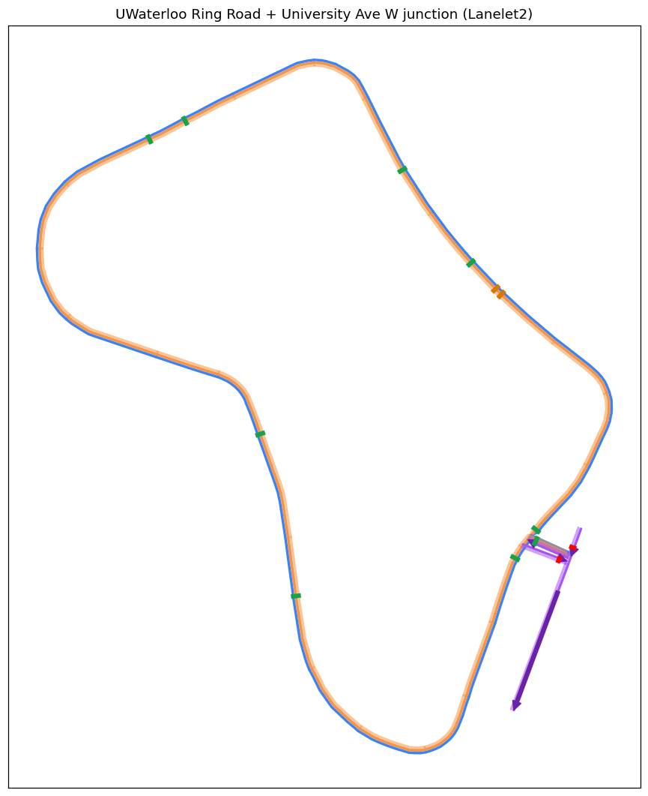

# UWaterloo Ring Road HD Map (Lanelet2)

Lanelet2 HD map of the University of Waterloo Ring Road loop, including the
University Avenue W crossing junction link lanes. Loadable by `world_model`'s
`lanelet_handler` (lanelet2 + German vehicle traffic rules + RoutingGraph).

Creates the ring road map requested in
[WATonomous/wato_monorepo#522][issue522].



**Scope note (S26 quest "HD Map" pillar):** this PR delivers a loadable,
validated, routing-correct map — the "basic ring road HD map loading and
visualization -> functional" tiers (1–4/10). The 7/10 and 10/10 tiers require
on-sim / on-vehicle laps of the full loop, which are separate testing work.

[issue522]: https://github.com/WATonomous/wato_monorepo/issues/522

## Contents

| File                    | Description                                                  |
| ----------------------- | ------------------------------------------------------------ |
| `ringroad_osm.osm`      | Source OSM export (WGS84) of the ring road + junction nodes. |
| `build_lanelet_map.py`  | Generates the Lanelet2 map from the source OSM.              |
| `ringroad_utm.osm`      | **Generated artifact** — both boundaries + lanelets in UTM 17N. |
| `map_tests.py`          | Offline validation harness (16 structural/topology/geometry checks). |
| `preview_map.py`        | Renders `ringroad_utm_preview.png` (matplotlib).             |
| `ringroad_utm_preview.png` | Preview showing loop (blue=fwd, orange=rev), UV links (purple), traffic lights (red), stop signs (green). |

## Reproduce

```sh
# requires a working python3 (stdlib only, except preview -> matplotlib)
python3 build_lanelet_map.py ringroad_osm.osm ringroad_utm.osm
python3 map_tests.py             # expect: 16 passed, 0 failed
python3 preview_map.py           # writes ringroad_utm_preview.png
```

The build is deterministic (regenerating `ringroad_utm.osm` produces the exact
committed file).

## Map contents

- **Ring loop**: 64 lanelets (32 fwd / 32 rev), ~2.73 km circumference,
  bidirectional two-way loop. Speed limit 40 km/h.
- **University Ave W junction links** (5):
  - `ringroad_uv_exit` — ring exit eastbound onto University (one-way, traffic light)
  - `ringroad_uv_enter` — University westbound into the ring (all-way stop)
  - `uvway_east_in` — University eastbound approach to the junction (traffic light)
  - `uvway_west_out` — University westbound out of the junction (from exit)
  - `uvway_connect` — short connector within the junction
  - Speed limit 50 km/h.
- **Regulatory elements** (14 total): traffic lights on the exit/east-in links,
  all-way stop on the ring-entry link, plus the source OSM's stop lines.
- Coordinates follow the lanelet2 osm convention: node `lat` = UTM easting (m),
  `lon` = UTM northing (m), zone 17N, WGS84. Includes the required
  `annotation/meta/lanelet_version` header.

## Install (per-machine, `maps/` is a gitignored docker mount)

`wato_monorepo` mounts `./maps` into the container at `/opt/watonomous/maps`.
Copy the artifact where the config expects it:

```sh
mkdir -p maps/ring_road/lanelet
cp tools/maps/ring_road/ringroad_utm.osm maps/ring_road/lanelet/ringroad_utm.osm
```

## Run with world_model

Use the new ring-road config (origin = map center, WGS84):

```sh
ros2 launch world_modeling_bringup world_modeling.launch.yaml \
  config_file:=$(find-pkg-share world_modeling_bringup)/config/world_model_ring_road.yaml
```

Verify in Foxglove:
- `map_viz_markers` — lanelet boundaries, stop lines, traffic lights, direction arrows, lanelet ids.
- `route_ahead_markers` / `lanelet_ahead_markers` — full-loop routing continuity.
- `lane_context` while driving: current lanelet should be the ring lanelet under the ego, with `lanelet.ahead.distance` counting down through a full lap.

## Known limitations

- One lanelet per travel direction (single-lane model), not per-lane.
- Only the University Avenue W crossing is included. Columbia St W and
  Phillip St are grade-separated (share no ring nodes) and are excluded by design.
- Narrowest lanelet (`ringroad_seg30_fwd`, ~2.4 m at the sharp southeast
  junction corner) is offset-boundary geometry at the tight bend, not a map bug;
  lanelet2 does not validate lanelet width.
- Localization (`eidos`) map of the ring road is out of scope for #522.

## Provenance

Source OSM from the standard OSM export of the ring road
(`highway=unclassified` loop, split into segments) plus the University junction
nodes/ways. Reconcile with @lucasreljic's copy if it differs before review.
